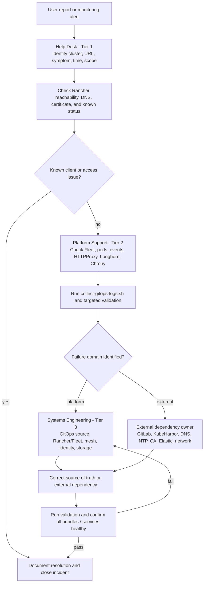
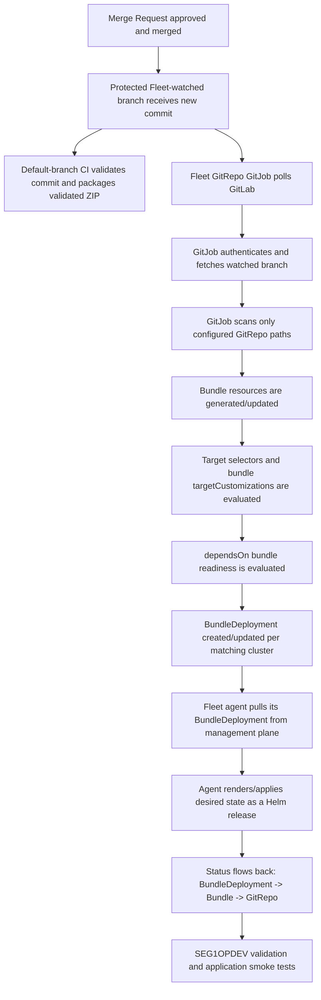

# Troubleshooting and Support

> **Baseline:** v2.7.1 — September 11, 2026  
> **Documentation update:** September 15, 2026 — repeatable bundle/application onboarding and GitLab/Fleet reconciliation workflow.  
> **Audience:** help desk, support technicians, platform support, systems engineers, and senior escalation engineers.

## 1. Support model

The support objective is to identify the **failure domain** before changing the environment. Most visible failures fall into one of four categories:

1. client/access problem;
2. Kubernetes workload/platform problem;
3. GitOps/source-of-truth problem; or
4. external dependency problem such as GitLab, KubeHarbor, DNS, NTP, CA, Elastic, or network routing.



## 2. Incident information required from the help desk

Tier 1 should capture the following before escalation:

- user/customer and callback/contact path;
- date/time and timezone of the failure;
- affected service/URL;
- affected cluster if known;
- exact error message or screenshot;
- whether the issue affects one user, one site, one cluster, or everyone;
- whether it ever worked and the last known-good time;
- recent maintenance/change window if known;
- browser/client source network and source IP when relevant to restricted UIs;
- ticket severity and business impact.

Do **not** ask Tier 1 to delete pods, change Fleet bundles, modify Helm releases, or edit cluster labels.

## 3. Tier 1 — Help Desk checklist

### Rancher or administrative UI unavailable

1. Verify the hostname resolves to the expected Segment1 VIP.
2. Verify the client is on an allowed network.
3. Check whether the browser reports DNS, TCP timeout, HTTP error, or certificate error.
4. Try another known-good administrative URL to determine whether the problem is service-specific or the entire ingress path.
5. Escalate with the exact URL, source network, time, and browser error.

Administrative URLs:

| Service | Management | j64 | j52 | r01 |
| --- | --- | --- | --- | --- |
| Longhorn | `longhorn-man.dev.kube` | `longhorn-j64.dev.kube` | `longhorn-j52.dev.kube` | `longhorn-r01.dev.kube` |
| Kiali | `kiali-man.dev.kube` | `kiali-j64.dev.kube` | `kiali-j52.dev.kube` | `kiali-r01.dev.kube` |

Rancher is `rancher.dev.kube`; identity is `opkeycloak.dev.jde.cybercom.ic.gov`.

### Important Longhorn UI behavior

The Longhorn HTTPProxy allows only `1.0.0.0/23` by design. A user outside the trusted Segment1 source range may be denied even when Longhorn is healthy. Treat that as an access-policy issue, not a storage outage.

## 4. Tier 2 — Platform Support first checks

Set the relevant kubeconfig context and start read-only:

```bash
kubectl --context j64seg1opman get nodes
kubectl --context j64seg1opman get pods -A
kubectl --context j64seg1opman get events -A --sort-by=.lastTimestamp | tail -100
```

Then run the platform validators appropriate to the symptom:

```bash
./scripts/deploy-platform.sh validate-rancher-system
./scripts/deploy-platform.sh validate-cluster-time
./scripts/deploy-platform.sh validate
./scripts/deploy-platform.sh validate-identity-ha
./scripts/deploy-platform.sh validate-monitoring
```

Collect a diagnostic archive before disruptive changes:

```bash
./scripts/collect-gitops-logs.sh
```

Attach the generated archive to the incident/escalation.

## 5. Determine whether Fleet is reconciling the expected branch

A common and highly deceptive failure is editing one branch while Fleet is configured to reconcile another. Always check:

```bash
git branch --show-current
grep '^FLEET_REPO_BRANCH=' "$KMM_FLEET_CONFIG"
```

Then inspect the live GitRepo branch and commit:

```bash
kubectl --context j64seg1opman -n fleet-default   get gitrepo -o custom-columns=NAME:.metadata.name,BRANCH:.spec.branch,COMMIT:.status.commit
kubectl --context j64seg1opman -n fleet-local   get gitrepo -o custom-columns=NAME:.metadata.name,BRANCH:.spec.branch,COMMIT:.status.commit
```

If the live commit is not the intended Git commit, correct the Git/runtime configuration first. Deleting Bundles will only recreate the same undesired state.

For the complete application/bundle onboarding workflow, GitLab merge-request procedure, and post-merge Fleet internals, see **Section 20**.

## 6. Fleet Bundle states

### `ErrApplied` with `dependent bundle(s) are not ready`

The displayed bundle is usually **not** the root cause. Follow the named dependency upstream until the first bundle with a direct Helm/schema/resource error is found.

Example chain:

```text
kiali-resources -> kiali -> kiali-operator -> istiod
```

Investigate the first non-ready dependency rather than each downstream red bundle separately.

### `Modified`

`Modified` means the live resource differs from Fleet's normalized desired state. Determine whether this is expected controller mutation or real drift.

Known intentional normalization examples include Istio validating-webhook `caBundle` injection and narrowly scoped operator ownership-label mutation. Do not broadly ignore an entire resource when a field-specific comparison rule is sufficient.

### Missing bundle matching `kmm.dev/bundle=<name>`

Check the Git branch/commit first. Then check that the required bundle path is included in the correct GitRepo and carries the expected label. Retired dependencies such as old Trident bundle names should not exist in the Longhorn design.

## 7. Rancher/Fleet agent problems

### Cluster agent will not connect

Check:

- `rancher.dev.kube` DNS and TLS;
- Contour `rancher-httpproxy` validity;
- WebSocket path `wss://rancher.dev.kube/v3/connect/register`;
- `cattle-system` agent pod logs/events;
- firewall/proxy timeout behavior.

Use:

```bash
./scripts/deploy-platform.sh validate-rancher-system
./scripts/deploy-platform.sh validate-rancher-imports
```

### PodSecurity rejection

Typical event:

```text
pods "fleet-agent-..." is forbidden: violates PodSecurity "restricted:latest"
```

Repair the scoped Rancher/Fleet system namespaces:

```bash
./scripts/deploy-platform.sh repair-rancher-psa
```

### Fleet watch-stream/cache problems on Kubernetes 1.35

Symptoms can include repeated watch decode/stream errors, BundleDeployments remaining in `WaitApplied`, or `preflight-fleet` reporting downstream Fleet Cluster resources that do not propagate `KUBE_FEATURE_WatchListClient=false` through `spec.agentEnvVars`.

Repair and verify the controller plus every downstream Fleet agent contract:

```bash
./scripts/deploy-platform.sh repair-rancher-agents
./scripts/deploy-platform.sh preflight-fleet
```

The expected control is `KUBE_FEATURE_WatchListClient=false` on the Fleet controller, `fleet-local`, and every `fleet-default` Cluster resource/agent. `preflight-fleet` now fails with the repair command instead of continuing with a partially configured Fleet runtime.

## 8. KubeHarbor and image/chart pull failures

Symptoms:

- `ImagePullBackOff` / `ErrImagePull`;
- Fleet OCI chart authentication/TLS failures;
- GitJob cannot resolve or authenticate to Harbor;
- Rancher Helm operation pods fail during disconnected bootstrap.

Checks:

```bash
./scripts/deploy-platform.sh validate-rancher-registry
./scripts/deploy-platform.sh configure-management-dns
./scripts/deploy-platform.sh validate-fleet-oci
```

Confirm:

- DNS resolves `kubeharbor.dev.kube` from nodes **and pods**;
- CA chain is trusted;
- credentials are valid;
- required chart/image exists at the exact expected path/tag;
- node RKE2 `registries.yaml` trust/authentication is correct.

Do not bypass TLS validation to make the error disappear.

### Package validation reports missing identity/failover safety tokens

First check for truncated shell files:

```bash
find scripts -type f -name '*.sh' -empty -print
./scripts/deploy-platform.sh validate-package
```

A zero-byte `identity-postgres.sh`, switchover, failback, standby-rebuild, or replication-verifier file means the deployment archive is incomplete—not that the clusters need rebuilding. Stop deployment and replace the package with a validated archive. Do not create placeholder scripts or bypass the token checks. The validator now rejects every empty, non-executable, incorrectly shebanged, or syntactically invalid shell file before any cluster-changing phase can run, and reports identity/failover contract defects together.

## 9. Chrony / time troubleshooting

### Pod Running but time is not synchronized

A Running Chrony container is not proof of synchronized host time.

```bash
./scripts/deploy-platform.sh validate-cluster-time
```

Target a cluster:

```bash
./scripts/management/preflight/cluster-time.sh --context j64seg1opdev --verify-only
```

Inspect one pod:

```bash
kubectl --context j64seg1opdev -n kube-system exec <chrony-pod> -- chronyc sources -v
kubectl --context j64seg1opdev -n kube-system exec <chrony-pod> -- chronyc tracking
kubectl --context j64seg1opdev -n kube-system exec <chrony-pod> -- chronyc ntpdata <ntp-server>
```

Healthy state requires a `^*` selected source, positive stratum, and `Leap status: Normal`.

### UDP/123 works but Chrony will not select the server

Check the **server's NTP status**, not just connectivity. A reply with leap indicator `unknown/unsynchronized` (`LI=3`) or stratum 0 is invalid as a synchronization source. Escalate to the NTP/AD time-service owner.

Probe the endpoint directly without changing the deployment host's clock:

```bash
./scripts/deploy-platform.sh test-ntp <server-or-ip> 5
```

The `chrony-status` sidecar provides compact periodic state:

```bash
kubectl --context j64seg1opdev -n kube-system   logs -l app=chrony-client -c chrony-status --tail=100
```

## 10. Longhorn troubleshooting

### Longhorn bundle is Active but PVC will not bind

Check:

```bash
kubectl --context <ctx> -n longhorn-system get pods -o wide
kubectl --context <ctx> get nodes -L node.longhorn.io/create-default-disk
kubectl --context <ctx> get storageclass
kubectl --context <ctx> get pvc -A
kubectl --context <ctx> get events -A --sort-by=.lastTimestamp | tail -100
```

Run host validation:

```bash
./scripts/management/preflight/longhorn-storage-preflight.sh --context <ctx>
```

Common root causes include missing iSCSI packages/service, `/mnt/k8sdata` not XFS, insufficient capacity, incorrect mount propagation, multipath claiming devices, or the worker lacking the approved Longhorn disk label.

### Longhorn UI unavailable

Check DNS, source IP policy, `longhorn-ui` Certificate, `longhorn-ui` HTTPProxy, `longhorn-frontend` Service, Envoy, and both sides of the NetworkPolicy path:

```bash
kubectl --context <ctx> -n longhorn-system get certificate,httpproxy,svc,pods
kubectl --context <ctx> -n longhorn-system describe httpproxy longhorn-ui
kubectl --context <ctx> -n longhorn-system get networkpolicy longhorn-ui-allow-segment1-envoy -o yaml
kubectl --context <ctx> -n segment1 get networkpolicy segment1-allow-envoy-to-platform-backends -o yaml
kubectl --context <ctx> get namespace longhorn-system --show-labels
```

The `longhorn-frontend` Service exposes port 80 but targets the Longhorn UI pods on TCP/8000. Calico enforces NetworkPolicy on the translated pod destination, so the Longhorn ingress policy and Segment1 Envoy egress policy must both permit TCP/8000. The `longhorn-system` namespace must also carry `segment1.ingress/allow-backend=true`. An Envoy response containing `upstream connect error ... connection timeout` with a Valid HTTPProxy is a strong indicator that the backend policy path should be checked.

## 11. HTTPProxy `invalid`

Contour marks the object invalid when the desired route cannot be constructed. Check:

```bash
kubectl --context <ctx> -n <ns> describe httpproxy <name>
kubectl --context <ctx> -n <ns> get svc,secret,certificate
```

Typical causes:

- referenced Service does not exist;
- referenced service port is wrong;
- TLS Secret does not exist/has not become Ready;
- invalid schema/route field;
- wrong ingress class;
- dependency has not yet created the backend.

For Keycloak, the standby site intentionally keeps its Service, TLS Certificate, and HTTPProxy **pre-staged** while `keycloakInstances=0`; the route stays dark because there are zero ready Keycloak endpoints. Treat a Valid standby HTTPProxy with zero endpoints as expected. Treat standby ready endpoints as a possible dual-active condition, and treat a missing/invalid standby HTTPProxy or Certificate as degraded failover readiness.

## 12. Istio troubleshooting

### `istio-base` or `istiod` shows `Modified`

Inspect Fleet diff details. Istio injects validating-webhook CA data at runtime; the repository uses field-specific comparison rules for that expected mutation. A new or different drift field should be investigated rather than ignored globally.

### East-west gateway fails Helm schema validation

The Istio Gateway chart version in this baseline does not accept obsolete root `hub`/`tag` values. Those image settings are provided through supported Istio configuration. If schema errors reappear, verify the deployed branch and values against the packaged chart schema.

### Cross-cluster traffic failure

Check east-west gateway VIP, Gateway/Service readiness, Istio remote Secrets, trust material, network routing, and explicit namespace injection state.

## 13. Kiali troubleshooting

Kiali can be Running while external metrics are unavailable. Check:

- Kiali pod/readiness;
- Kiali HTTPProxy/Certificate;
- external Prometheus URL/readiness;
- external Grafana URL/readiness;
- `kiali-grafana-credentials` Secret/RBAC;
- connectivity and CA trust from Kiali to those external endpoints.

## 14. Keycloak / CloudNativePG troubleshooting

Validate site roles first:

```bash
./scripts/deploy-platform.sh validate-identity-ha
```

Check:

```bash
kubectl --context j64seg1opdev -n opkeycloak get pods,svc,httpproxy,certificate
kubectl --context j64seg1opdev -n oppostgres get pods,pvc
kubectl --context j52seg1opdev -n oppostgres get pods,pvc
```

Common failure domains:

- Longhorn PVC not Bound;
- CNPG operator or cluster not Ready;
- CloudNativePG operator blocked from an instance-manager status endpoint on TCP/8000;
- CNPG bootstrap, database, or PgBouncer instance manager blocked from the cluster-local Kubernetes API Service on TCP/443 or its post-DNAT control-plane endpoints on TCP/6443;
- CNPG replica join/bootstrap pod timing out to the local `*-rw` Service on TCP/5432 because a NetworkPolicy selected CNPG pods without allowing **both** local CNPG ingress and local CNPG egress;
- PgBouncer NetworkPolicy/PDB selectors not matching CNPG-owned `cnpg.io/poolerName` / `cnpg.io/podRole=pooler` labels;
- replication TLS/Secret missing;
- replication hostname missing from `dev.kube` or resolving to the wrong Segment1 VIP;
- WAL receiver absent, not `streaming`, connected to the wrong site, stale, or above the configured byte-lag limit;
- Keycloak backend Service absent;
- `opkeycloak` namespace missing `segment1.ingress/allow-backend=true`;
- standby/active labels inconsistent;
- ingress certificate or HTTPProxy invalid;
- DNS still targets the wrong site after failover.

For a CNPG status-path failure, inspect the operator log and policies together:

```bash
kubectl --context j64seg1opdev -n oppostgres logs -l app.kubernetes.io/name=cloudnative-pg --tail=200
kubectl --context j64seg1opdev -n oppostgres get networkpolicy -o yaml
kubectl --context j64seg1opdev -n oppostgres get pods --show-labels
```

The repository explicitly permits the CNPG operator to reach database instance-manager TCP/8000 and permits CNPG-managed workloads to reach both their site-local Kubernetes API Service on TCP/443 and its control-plane endpoints on TCP/6443. Both API representations are required because NetworkPolicy enforcement can occur before or after Service DNAT. It also pre-applies local CNPG cluster-member **ingress and egress** on TCP/5432 before the PostgreSQL Cluster bundle starts. Kubernetes NetworkPolicy is directional and additive: a connection is permitted only when the source egress policy and destination ingress policy both allow it. The September 2026 join failure was the concrete failure mode—DNS correctly resolved the local `*-rw` Service, ingress was present, but the CNPG pod was selected by an egress policy that omitted local database pods. Static validation now parses this policy semantically so an ingress-only regression cannot pass package validation. Default-deny policies remain workload-scoped so they do not unintentionally isolate the Keycloak or CloudNativePG operators that share the application namespaces.

Never promote the secondary by ad-hoc database or label changes. Use the controlled failover process and required fencing.

Run the supported replication diagnostic first:

```bash
./scripts/deploy-platform.sh verify-database-replication
```

The configured names are `j64seg1opdev-postgres-repl.dev.kube` (`1.0.0.216`) and `j52seg1opdev-postgres-repl.dev.kube` (`1.0.0.226`). A stale name such as `opkeycloak-postgres-j64.dev.kube` is not part of the contract. Confirm both records resolve from the database pods and that TCP/5432 is permitted in both directions. If `pg_stat_wal_receiver` has no row, inspect the standby Cluster's `spec.replica.source`, its matching `externalClusters` entry, replication TLS Secrets, CNPG logs, DNS, and NetworkPolicies.

### CloudNativePG `External cluster ... not found` admission failure

The following Fleet error is **remediable in place** and does not require rebuilding healthy Kubernetes clusters:

```text
spec.replicaCluster.self: Invalid value: "j64seg1opdev": External cluster j64seg1opdev not found
spec.replicaCluster.primary: Invalid value: "j64seg1opdev": External cluster j64seg1opdev not found
```

CloudNativePG distributed topology validates `spec.replica.self`, `spec.replica.primary`, and `spec.replica.source` against the topology names present in `spec.externalClusters`. When the Kubernetes `Cluster` object is named `oppostgres-opkeycloak-db` on both sites, the repository uses `replica.self` to provide unique site IDs. That means **both site IDs must be listed in `externalClusters` on both distributed Cluster definitions**, even though only the peer is used as the active streaming source at a given time.

The supported repair is:

```bash
./scripts/deploy-platform.sh validate-package
./scripts/deploy-platform.sh fleet
./scripts/deploy-platform.sh enable-identity-secondary
./scripts/deploy-platform.sh verify-database-replication
./scripts/deploy-platform.sh validate-identity-ha
./scripts/deploy-platform.sh validate
```

Do not delete the healthy J64 CNPG Cluster or rebuild the RKE2 clusters for this condition. `enable-identity-secondary` first forces the identity pair back to standalone streaming mode, creates/repairs J52 with `pg_basebackup`, exchanges replication TLS material, and only then enables the distributed topology. If final enrollment fails, it automatically reverts the Fleet topology labels to `false`, leaving J64 writable and J52 as a one-way replica instead of a permanent `ErrApplied` loop.

## 15. Elastic Agent troubleshooting

```bash
./scripts/deploy-platform.sh validate-monitoring
```

If one cluster fails, confirm:

- the cluster's specific enrollment token file was used;
- Fleet URL resolves/routes from the cluster;
- certificate SAN matches the Fleet URL;
- CA file is correct;
- the policy exists and is intended for that cluster;
- the Elastic Agent Secret was seeded;
- `elastic-agent-system/kube-state-metrics` exists as an `ExternalName` Service pointing to `kube-state-metrics.elastic-monitoring.svc.cluster.local`;
- kube-state-metrics uses the `endpointslices` collector rather than the deprecated core/v1 `endpoints` collector on Kubernetes v1.33+.

If validation reports both `kube-state-metrics alias is missing or incorrect` and `Elastic Agent logs contain kube-state-metrics DNS failures` on every cluster, inspect the alias namespace first. The Elastic Kubernetes integration scrapes the short host `kube-state-metrics:8080`, so the compatibility alias must live in `elastic-agent-system`; an alias deployed to `kube-system` will be Fleet-Ready but will not resolve from the Agent namespace.

The validator evaluates Agent errors from the most recent two minutes by default (`ELASTIC_AGENT_LOG_SINCE=2m`) so already-remediated DNS/TLS errors do not remain blocking solely because they are still present in a large log tail. Override the window when investigating intermittent failures.

## 16. `helm-operation-*` pods

Rancher creates temporary Helm operation pods for system-chart work. A failed `1/2` operation can block Rancher provisioning/import workflows.

Use the Rancher system validator/repair workflow to capture their logs and clean up failed temporary operations safely:

```bash
./scripts/deploy-platform.sh validate-rancher-system
./scripts/deploy-platform.sh repair-rancher-system
```

Do not indiscriminately delete all Helm operation resources while Rancher is actively reconciling.

## 17. GitLab Runner troubleshooting

For a pending or failed `gitops-validation` job, check in order:

1. the GitLab runner is online, protected, locked to the intended scope, and tagged `gitops-validation`;
2. `gitlab-runner-system/gitlab-runner` is Ready and can verify its `glrt-*` token;
3. the GitLab CA Secret contains `gitlab001.dev.local.crt`;
4. KubeHarbor contains the pinned manager, helper, and Ansible validation images;
5. the job pod is admitted by restricted PodSecurity and can pull `regcred-kubeharbor`;
6. the `runner:canary` job actually creates an executor pod, clones the repository, pulls the helper and Ansible job images, and uploads its harmless artifact before package validation starts;
7. the job image exposes Bash and a Python interpreter whose imported `yaml` module implements `safe_load` and `safe_load_all`.

The Iron Bank UBI manager requires `/usr/local/bin/tini`, `useTini: true`, and UID/GID `1001`. If `/usr/local/bin/tini` is missing, verify the exact image before changing the chart command—the old Docker Hub manager image and the Iron Bank security contract must not be mixed.

The expected manager is `kubeharbor.dev.kube/ironbank/gitlab/gitlab-runner/gitlab-runner:v19.3.1`; the helper is `kubeharbor.dev.kube/ironbank/gitlab/gitlab-runner/gitlab-runner-helper:v19.3.1`. The runner allowlist is intentionally exact for the approved Ansible job image; depth-limited `kubeharbor.dev.kube/*` patterns are not accepted. A pull attempt against `kubeharbor.dev.kube/gitlab/...`, or a helper ending in `ubuntu-v19.3.1`, is stale.

If validation reports `yaml module is missing required PyYAML API: safe_load, safe_load_all`, treat it as Python module shadowing or the wrong interpreter—not as proof that PyYAML is absent. The pipeline now probes candidate interpreters in isolated mode, exports `PYTHONSAFEPATH=1`, creates a job-local wrapper that execs the exact interpreter that passed the PyYAML probe, and prints the selected interpreter plus the imported PyYAML file/version. A local repository file/module named `yaml` can no longer silently win over the approved PyYAML installation. The former `CI_PROJECT_DATA`/`phthon3` and hard-coded `/home/python/python-env/bin/activate` assumptions are invalid.

Collect evidence without printing Secret data:

```bash
kubectl --context j64seg1opman -n gitlab-runner-system get deploy,pods,events
kubectl --context j64seg1opman -n gitlab-runner-system logs deployment/gitlab-runner --since=30m
kubectl --context j64seg1opman -n gitlab-runner-system exec deployment/gitlab-runner -- gitlab-runner verify
```

## 18. Escalation package for systems engineering

Tier 2 should include:

1. diagnostic archive from `collect-gitops-logs.sh`;
2. affected cluster/context;
3. Git branch and local commit;
4. live Fleet GitRepo branch/commit;
5. `validate-package` result if a recent code change is involved;
6. relevant `describe` output for HTTPProxy/PVC/Pod/Bundle;
7. exact timestamps and recent change window;
8. whether GitLab, KubeHarbor, DNS, NTP, CA, Elastic, or network teams have confirmed their services healthy.

### Diagnostic collector signal model

The diagnostic archive is deliberately broad, but `error-index.txt` is intentionally high-signal. The collector/validators use the following contract:

- Elastic Agent JSON records are evaluated by their `.message` field instead of raw whole-record regular expressions, which prevents unrelated dataset/configuration fields from creating false monitoring failures.
- Elastic Agent runtime error inspection defaults to `ELASTIC_AGENT_LOG_SINCE=2m`; widen the window only when investigating an intermittent condition.
- kube-state-metrics validation checks the live Deployment and requires the `endpointslices` collector rather than deprecated core/v1 `endpoints`.
- `error-index.txt` indexes current blockers, Kubernetes Warning/failure events, and current-container high-severity/runtime-failure lines. Bulk YAML/JSON object dumps and previous-container logs remain in the archive for forensic review but do not dominate first-pass triage.
- `current-blockers.txt` captures downstream/local Fleet pause state, the identity transition journal, the transition Lease, and active identity DNS status.
- The `segment1` namespace is collected so Contour/Envoy logs, events, Services, and NetworkPolicies are available when an HTTPProxy returns `no healthy upstream`.

This model keeps the archive comprehensive while preventing benign historical/configuration text such as `failureThreshold`, `timeoutSeconds`, or empty `*Error` fields from being treated as current blockers.

## 19. Engineering recovery rules

- Prefer Git correction/revert for Fleet-owned resources.
- Prefer supported repair scripts for Rancher/Fleet state.
- Do not disable TLS verification as a permanent fix.
- Do not manually format/repair Longhorn disks through the preflight tool; it is validation-only.
- Do not delete Chrony without the supported restore path.
- Do not manually reverse identity role labels.
- Capture evidence before destructive actions.
- After remediation, rerun the applicable validator and confirm dependent Fleet bundles return Active.


### Fleet GitRepo shows `Stalled=True` after a successful reconciliation

A transient Git server or network timeout can leave an older `Stalled=True` condition visible even when the same GitRepo later reports `Ready=True`, `GitPolling=True`, a current commit, and all BundleDeployments Ready. Treat the workload state and condition timestamps separately. The repository validator warns and continues only when those current-health signals are all present; an active stall still fails validation.

For the downstream GitRepo, first verify GitLab DNS/HTTPS reachability from the management cluster, then force a new Fleet sync with `./scripts/deploy-platform.sh fleet`. Do not delete healthy Bundles merely to clear the UI condition.

A Rancher count such as `25/27 Bundles ready` can also be expected in the normal primary-site topology when the secondary Keycloak and PostgreSQL-replica bundles are intentionally targetless (`0/0`). Confirm the BundleDeployments and resource counts before treating that ratio as a deployment failure.

### Keycloak Operator reports `409 Conflict` while Keycloak server Pods are healthy

Run exactly one `opkeycloak-operator` replica for a given watched namespace. The Keycloak server remains highly available through the Keycloak CR `spec.instances`; scaling the Operator controller itself creates multiple reconcilers updating the same CR and can produce resource-version/status conflicts. The CIS renderer and generated Operator manifest intentionally preserve one Operator replica.

The Keycloak CR `unsupported.podTemplate` must also avoid overriding the Operator-owned container name or command/args. Use it only for the additional volumes, mounts, and container security context required by the runtime keytab/provider integration.

### Keycloak JDBC timeout to CloudNativePG / PgBouncer

If `opkeycloak-0` reports `Unable to obtain isolated JDBC connection` or `The connection attempt failed` while the CNPG cluster and PgBouncer pods are Ready, verify the NetworkPolicy selectors on both sides of TCP/5432. The Keycloak Operator owns the server labels (`app=keycloak`, `app.kubernetes.io/instance=opkeycloak`, and `app.kubernetes.io/managed-by=keycloak-operator`). Do not authorize PostgreSQL ingress with `app=opkeycloak`; that label is not an operator-owned contract. The prerequisite `oppostgres-resources` bundle installs the Keycloak-to-PgBouncer ingress rule before the Keycloak CR starts. Repository-managed NetworkPolicies own Keycloak traffic, so the operator-generated Keycloak NetworkPolicy is disabled.

### Keycloak replicas start, stop, or continuously reform the cache cluster

If the JDBC error is resolved but the three `opkeycloak-*` pods repeatedly transition between startup/readiness states, inspect JGroups/Infinispan messages and pod events. With `cache-stack=jdbc-ping`, the database is used for peer discovery, while Keycloak members still communicate directly over TCP/7800 and TCP/57800. Because the repository applies an ingress/egress default deny to the Keycloak application pods, both ports must be explicitly allowed from Keycloak server pods to Keycloak server pods. The `opkeycloak-allow-cluster` NetworkPolicy owns this path in both identity-site bundles.

Useful checks:

```bash
kubectl -n opkeycloak get networkpolicy opkeycloak-allow-cluster -o yaml
kubectl -n opkeycloak get pods -l app=keycloak -o wide
kubectl -n opkeycloak logs opkeycloak-0 --previous | egrep -i 'jgroups|infinispan|cluster|suspect|7800|57800|failure'
```

### Replication healthy but planned identity failover says topology is not enrolled

`verify-database-replication` validates the data path; it does not by itself mean Fleet has enrolled both CNPG clusters in the promotion-capable distributed topology. If Fleet labels show `kmm.dev/postgres-distributed-topology=false`, run:

```bash
./scripts/deploy-platform.sh enable-identity-secondary
./scripts/deploy-platform.sh validate-identity-ha
```

The initial planned J64 → J52 `failover-identity` path can perform that enrollment automatically after `IDENTITY_SWITCHOVER_CONFIRM=j52seg1opdev` is supplied. Failback does not auto-enroll a missing topology; restore/rebuild the warm standby first. When querying the CNPG object manually, use the fully qualified resource `clusters.postgresql.cnpg.io/oppostgres-opkeycloak-db`; `cluster/...` can resolve to Rancher's `clusters.management.cattle.io` CRD on the management plane.

### Planned identity failover fails while creating the transition Lease

If `failover-identity` successfully verifies streaming replication and distributed-topology enrollment but then exits with an API error similar to:

```text
error when creating "STDIN": Lease in version "v1" cannot be handled as a Lease:
parsing time "...Z" as "2006-01-02T15:04:05.000000Z07:00": cannot parse "Z" as ".000000"
```

the database has not been demoted or promoted yet. The failure is in the Kubernetes transition-lock object, not PostgreSQL. `coordination.k8s.io/v1` Lease `acquireTime` and `renewTime` are Kubernetes `MicroTime` fields and require six fractional digits. The supported switchover script emits values such as `2026-09-08T16:55:29.000000Z` for both create and renew operations. Update the script/package rather than bypassing the safety lock. After updating, start the planned transition again with the normal confirmation variables. If a journal exists, inspect `./scripts/deploy-platform.sh identity-transition-status` before choosing a new transition versus `resume-identity-transition`.


### Planned identity transition stops at `fleet-paused` with `phase: unbound variable`

If `switchover-identity.sh` stops with an error similar to `line 191: phase: unbound variable` and `identity-transition-status` reports `stage=fleet-paused`, the transition has not yet fenced WAL or demoted/promoted either PostgreSQL site. The failure is a Bash `set -u` initialization defect in an older `run_phase_hook` implementation where `legacy_phase` referenced `phase` in the same `local` command. Update to the corrected package, preserve the existing journal and Fleet pause state, set `IDENTITY_SWITCHOVER_CONFIRM` to the recorded target, and use `./scripts/deploy-platform.sh resume-identity-transition`. Do not start a second transition and do not manually unpause Fleet.

### Planned identity transition stops at `fleet-labels-switched` with target TLS Certificate not Ready

A planned transition that has already reached `target-promoted` or `fleet-labels-switched` is **past database demotion/promotion**. Do not start a second failover and do not use the pre-demotion rollback path. If the downstream Fleet GitRepo is still paused, the old failover sequencing can deadlock: the controller changes the Fleet role labels while paused and then waits for the target Keycloak Certificate/HTTPProxy, even though those resources are Fleet-owned and cannot reconcile until Fleet resumes.

The corrected workflow inserts a `fleet-target-reconciled` stage between `fleet-labels-switched` and `target-keycloak-ready`. It restores the GitRepo's original active state, waits for `oppostgres`, `oppostgres-replica`, `opkeycloak`, and `opkeycloak-secondary` to become Ready under the new role labels, validates the target Certificate and HTTPProxy, and then performs a direct HTTPS/OIDC health probe against the target Segment1 VIP using `curl --resolve`. Canonical DNS/hosts cutover is not accepted until that pre-cutover target health gate passes.

For a journal already stopped at `fleet-labels-switched`, update to the corrected package, preserve the journal and Lease, then run:

```bash
export IDENTITY_SWITCHOVER_CONFIRM=j52seg1opdev
./scripts/deploy-platform.sh resume-identity-transition
unset IDENTITY_SWITCHOVER_CONFIRM
```

Do not manually patch the PostgreSQL role back to J64. At this stage J52 is intentionally writable and J64 is the warm replica.

The Keycloak Certificate and HTTPProxy are now pre-staged on **both** identity sites even when `keycloak-instances=0`. This removes certificate issuance from the outage-critical path and lets a new planned transition fail its exposure preflight before source traffic is quiesced.

### Kiali repeatedly reports `FailedToRetrieveImagePullSecret` for `map[name:regcred-kubeharbor]`

If Kiali or the Kiali Operator pod spec contains:

```yaml
imagePullSecrets:
  - name: map[name:regcred-kubeharbor]
```

then the real registry Secret is not missing. The Kiali Helm/Kiali CR values supplied the secret as a mapping instead of a secret-name string. Kiali 2.x expects the pull-secret lists to contain strings. The supported values are:

```yaml
# kiali-operator
image:
  pullSecrets:
    - regcred-kubeharbor

# kiali server / Kiali CR-compatible chart values
deployment:
  image_pull_secrets:
    - regcred-kubeharbor
```

After Fleet reconciles these values, the Kiali and Kiali Operator workloads roll with `imagePullSecrets[].name=regcred-kubeharbor`; the recurring kubelet warning should stop.


### Keycloak `no healthy upstream` during/after identity switch

First identify whether the request used the canonical FQDN. The Keycloak `HTTPProxy` matches `opkeycloak.dev.jde.cybercom.ic.gov`; browsing a raw ingress IP is not a valid route/TLS health check because the required FQDN/SNI is missing. Run:

```bash
./scripts/deploy-platform.sh identity-exposure-status all
```

The active site must report three ready endpoints, a Ready Certificate, a valid HTTPProxy whose VIP equals the site ingress VIP, and `directOIDC=healthy`. The warm standby is intentionally dark: `keycloak-instances=0` and zero ready endpoints are expected, while its Service, Certificate, and HTTPProxy remain pre-staged for faster switchover. A published standby HTTPProxy with **zero** ready endpoints is therefore a healthy HA state, not a validation error.

If the target direct OIDC gate has passed, the next production gate is the DNS Admin CNAME change. The normal journal state is `status=waiting-external`, `stage=dns-cutover-pending`. Run:

```bash
./scripts/deploy-platform.sh identity-transition-status
./scripts/deploy-platform.sh identity-dns-status <target>
```

`identity-dns-status` queries each configured Segment1 DNS server in `IDENTITY_DNS_SERVERS` directly. Require `segment1DnsConsensus=match`: every configured resolver should return the target ingress CNAME and only the target ingress VIP when `IDENTITY_DNS_REQUIRE_ALL_SERVERS=true` (the default). The deployment controller's own resolver is shown as `controllerResolvedIPv4` / `controllerCanonicalOIDC` for diagnostics only; it is **not** the production DNS gate.

After DNS Admins change `opkeycloak.dev.jde.cybercom.ic.gov` from the source ingress alias to the target alias (`j64seg1opdev-ingress` or `j52seg1opdev-ingress`), set `IDENTITY_TRAFFIC_CUTOVER_CONFIRM=<recorded-target>` and resume the **same** journal. Do not start another switch, do not manually reverse database roles, and do not use raw ingress-IP browsing as the route test.


### Planned switchback fails at `source-wal-fenced` with `promotionToken is only allowed for primary clusters`

This is the failure signature seen when the **first** planned switchover succeeds but the reverse-direction switchback fails immediately after the final WAL replay gate. The API error may reference `spec.replicaCluster.token` or `spec.replica.promotionToken` and state that the promotion token is only allowed for primary clusters.

Root cause: the site promoted during the prior switchover still has the one-shot token stored in `spec.replica.promotionToken`. A JSON merge patch that changes only `replica.primary` preserves that field. CloudNativePG then evaluates the resulting object as a replica that still carries a promotion token and correctly rejects it. Diagnostic evidence typically looks like:

```text
sourceReplicaPrimary=<source-site> sourcePromotionToken=present sourceLastPromotionToken=present
stage=source-wal-fenced
... promotionToken is only allowed for primary clusters
```

The current controller fixes this in two places: source demotion removes any consumed token **in the same API patch** that changes the distributed-topology primary, and successful target promotion waits for `status.lastPromotionToken` to match before deleting `spec.replica.promotionToken`. `validate-identity-ha` then rejects any stale steady-state token so the problem is caught before the next maintenance window.

If an older package already stopped at `source-wal-fenced`, keep the journal/Fleet pause state intact, deploy the corrected scripts, set `IDENTITY_SWITCHOVER_CONFIRM` to the recorded target, and use `resume-identity-transition`. Do not start an opposite transition and do not hand-edit the CloudNativePG token unless performing a documented break-glass recovery.

For a fresh rebuild, acceptance must include **both directions**: J64 -> J52 and J52 -> J64. A single successful first switchover does not prove reversible failover.

### Identity failover first-response commands

For any identity incident, capture state before changing anything:

```bash
cd /home/k8admin/k8mm-seg1opdev-multicluster

./scripts/deploy-platform.sh identity-transition-status
./scripts/deploy-platform.sh identity-transition-diagnostics
./scripts/deploy-platform.sh identity-active-site
./scripts/deploy-platform.sh identity-exposure-status all
./scripts/deploy-platform.sh identity-dns-status active
```

If the active source is reachable and a maintenance transition is intended, also require:

```bash
./scripts/deploy-platform.sh verify-database-replication
./scripts/deploy-platform.sh validate-identity-ha
```

If the active source is **not** reachable, do not use failure of `verify-database-replication` as proof that the surviving replica is unusable. Follow the unplanned runbook in Operations and Lifecycle: capture the target's last replay LSN, accept the possible asynchronous-replication RPO, hard-fence the old source, and then use explicit `IDENTITY_SWITCHOVER_MODE=unplanned`.

If `j64seg1opman` is unavailable, the supported automated identity failover path is unavailable because its journal, Lease, and Fleet role control live on the management cluster. Restore management first rather than hand-patching CNPG or Fleet state.

For complete command-by-command procedures, use [Operations and Lifecycle — Identity operations](OPERATIONS-AND-LIFECYCLE.md#8-identity-operations). The operator diagrams are `diagrams/identity-planned-failover-runbook.mmd`, `diagrams/identity-unplanned-failover-runbook.mmd`, and `diagrams/identity-unplanned-recovery.mmd`.

### Identity switch decision matrix

Use this matrix before taking action on a failed identity move:

| Observed state | Correct action |
| --- | --- |
| No journal / terminal journal; source reachable; replication healthy | Start a planned `switch-identity <target>` after normal preflight. |
| Journal `running` or `failed` at any non-terminal stage | Do **not** start another switch. Set `IDENTITY_SWITCHOVER_CONFIRM` to the journal's recorded target and run `resume-identity-transition`. |
| Journal `waiting-external` / `dns-cutover-pending` | Target DB/Keycloak is prepared. DNS Admin changes the canonical CNAME; run `identity-dns-status <target>` and require `segment1DnsConsensus=match`, then set `IDENTITY_TRAFFIC_CUTOVER_CONFIRM=<target>` and resume the same journal. |
| Planned journal before `source-demoted` and the change must be abandoned | `rollback-identity-transition` is supported. |
| Journal at/after `source-demoted` or `target-promoted` | Do not rollback manually. Resume the recorded transition. |
| Current primary/site is lost or untrustworthy | Use unplanned mode only after hard-fencing the old source and accepting asynchronous-replication RPO risk. |
| Unplanned transition completes `complete-degraded` | Keep the old source fenced/hibernated; validate with `--allow-degraded`; rebuild the former primary before planned failback. |
| Active site canonical FQDN works but standby reports `no healthy upstream` | Expected when standby Keycloak instances are `0`; Service/TLS/HTTPProxy are intentionally pre-staged while endpoints remain zero. |
| Canonical FQDN fails on the site that `identity-active-site` reports active | Run `identity-exposure-status all`; inspect active site's endpoints, Certificate, HTTPProxy, direct OIDC result, Envoy/Contour logs/events, and traffic mapping. |

### Unplanned identity failover does not start

The unplanned path intentionally has more safety gates than a planned switchover. Verify all of the following are set for the intended target:

```bash
export IDENTITY_SWITCHOVER_CONFIRM=<target-site>
export IDENTITY_SWITCHOVER_MODE=unplanned
export IDENTITY_ALLOW_UNPLANNED_FAILOVER=true
export IDENTITY_UNPLANNED_RPO_ACK=I_ACCEPT_POSSIBLE_DATA_LOSS
export IDENTITY_HARD_FENCE_SOURCE_HOOK=/approved/executable/fence-source.sh
```

The hard-fence hook is mandatory because the old primary must not be able to return and accept writes after the surviving target is promoted. If the hook is missing, non-executable, or does not prove source isolation, fix the fencing mechanism instead of bypassing the check. If an unplanned journal is resumed before `source-hard-fenced`, re-export `IDENTITY_HARD_FENCE_SOURCE_HOOK`; the hook path is not persisted as executable journal state. Keep the actual source fence in force through `complete-degraded` operation and the standby rebuild.

The target must also have a trustworthy replay LSN. The workflow records the target's replay LSN and WAL receiver snapshot before pausing Fleet and promoting. If the target has no usable replay position, do not force promotion; determine whether the replica was ever successfully initialized and what recovery source is available.

### After unplanned promotion, former primary comes back online

Do not simply unhibernate/reconnect it. The former primary may be on a divergent timeline. Keep it fenced and use the supported rebuild workflow from the surviving writable site:

```bash
export IDENTITY_REBUILD_CONFIRM=<former-primary-site>
export IDENTITY_REBUILD_DELETE_STORAGE=true
./scripts/deploy-platform.sh rebuild-identity-standby <former-primary-site>
```

After rebuild, require both of these to pass before planned failback:

```bash
./scripts/deploy-platform.sh verify-database-replication
./scripts/deploy-platform.sh validate-identity-ha
```


### Identity failover appears stuck / convergence message does not change

Use the controller diagnostics before changing cluster state:

```bash
./scripts/deploy-platform.sh identity-transition-status
./scripts/deploy-platform.sh identity-transition-diagnostics
./scripts/deploy-platform.sh identity-dns-status <recorded-target>
```

The failover controller uses bounded Kubernetes and DNS operations; long waits print `WAIT gate=... elapsed=... remaining=...` with the blocking state. In the production `dns-admin` model, after target OIDC health is proven the controller journals `dns-cutover-pending`, prints `DNS ADMIN ACTION REQUIRED`, releases the transition lock, and exits successfully.

After DNS Admin acknowledgement, the controller validates the canonical record directly against the configured Segment1 DNS servers. With the shipped 30-second TTL it warns after the 90-second convergence grace. `IDENTITY_DNS_ADMIN_VALIDATION_TIMEOUT_SECONDS` defaults to 180 seconds. If Segment1 DNS still does not converge in that window, the transition returns to `status=waiting-external`, keeps the promoted database/Keycloak state intact, releases the lock, and exits without turning an external DNS dependency into a ten-minute blocking/failure loop. Correct DNS and resume the same journal again.

A healthy DNS gate looks like:

```text
dnsServer=<segment1-dns-1> ... status=match
dnsServer=<segment1-dns-2> ... status=match
segment1DnsConsensus=match
directTargetOIDC=healthy
controllerResolverGate=false
```

If one Segment1 resolver is `mismatch` while another is `match`, treat it as partial DNS convergence/replication and correct the DNS service before completing the transition. Do not lower `IDENTITY_DNS_REQUIRE_ALL_SERVERS` merely to force a switchover through a split DNS view.

### DNS is correct for Segment1 clients but failover reports `unresolved`

Older failover packages gated the DNS transition on the deployment controller's local resolver. That creates a false negative when the controller is not configured to resolve the enterprise identity zone even though Segment1 clients and the target ingress are healthy. Typical evidence is:

- direct target OIDC is healthy through `curl --resolve`;
- a Segment1 client resolves `opkeycloak.dev.jde.cybercom.ic.gov` to the target ingress alias/VIP and can load Keycloak; but
- transition output repeatedly shows `observedCNAME=unresolved`, `controllerDNS=unresolved`, and `canonicalOIDC=unhealthy`.

Use the current package and configure the protected runtime file with the DNS servers that Segment1 clients use for this zone:

```bash
IDENTITY_DNS_SERVERS="<segment1-dns-1> <segment1-dns-2>"
IDENTITY_DNS_REQUIRE_ALL_SERVERS=true
IDENTITY_DNS_ADMIN_VALIDATION_TIMEOUT_SECONDS=180
```

Then verify and resume the existing transition:

```bash
./scripts/deploy-platform.sh identity-transition-status
./scripts/deploy-platform.sh identity-dns-status <recorded-target>
export IDENTITY_SWITCHOVER_CONFIRM=<recorded-target>
export IDENTITY_TRAFFIC_CUTOVER_CONFIRM=<recorded-target>
./scripts/deploy-platform.sh resume-identity-transition
unset IDENTITY_SWITCHOVER_CONFIRM IDENTITY_TRAFFIC_CUTOVER_CONFIRM
./scripts/deploy-platform.sh validate-identity-ha
```

Do **not** start a second `switch-identity` and do **not** manually promote/demote PostgreSQL if the journal is already at/after `target-promoted`. The existing journal is the recovery control point.


## 20. Repeatable application/bundle onboarding through GitLab and Rancher Fleet

This section is the standard engineering workflow for introducing a new platform bundle or application to SEG1OPDEV. It is deliberately written as both an **implementation procedure** and a **troubleshooting runbook**. Follow the same path for a new application, a new Helm-based platform component, or a significant change to an existing Fleet bundle.

> **GitLab terminology:** GitLab calls a pull request a **Merge Request (MR)**. In this repository, changes must flow through an MR into the branch that Rancher Fleet is actually monitoring.

### 20.1 Control-plane ownership model

Do not start by manually installing an application with `helm install` or `kubectl apply`. The ownership model is:

| Control | Owner | Repository location / mechanism |
| --- | --- | --- |
| Steady-state Kubernetes desired state | Rancher Fleet | `fleet/bundles/` and `fleet/local-bundles/` |
| Management bootstrap network/certificate substrate | Bootstrap scripts | `scripts/core/` and management bootstrap workflows |
| Namespace creation, CIS/PSA labels, registry pull secrets, protected runtime secrets | Runtime preflight | `scripts/management/fleet/01-seed-runtime-secrets.sh` and related runtime scripts |
| Git repository/branch/path registration | Fleet GitRepo bootstrap | `scripts/management/fleet/03-bootstrap-gitrepos.sh` |
| Air-gap Helm/OCI inventory | Repository package contract | `helm/required-packages.txt`, `helm/fleet-oci-packages.txt`, `helm/required-oci-artifacts.txt`, `helm/SHA256SUMS` |
| Static package and semantic checks | CI/local validation | `scripts/validate-deployment-package.sh`, `scripts/validate-fleet-layout.sh` |
| Deployment/reconciliation | Fleet controller + Fleet agents | GitRepo -> Bundle -> BundleDeployment -> downstream Helm release |

The important boundary is that **Fleet owns steady-state resources, but runtime preflight owns namespaces and protected secrets**. A new application must fit that contract instead of creating a second source of truth.

### 20.2 Information required before creating the branch

Capture these items in the Jira change/MR before implementation:

1. application/bundle name and proposed numeric order, for example `73-example-app`;
2. target cluster(s) and the exact Fleet labels that identify them;
3. namespace and required PSA level (`restricted` unless the workload has a documented reason for `privileged`);
4. upstream Helm chart/version or repository-owned manifests/chart;
5. all container images and immutable tags/digests required in the air gap;
6. dependencies on existing bundles such as Longhorn, Contour, cert-manager, Istio, CNPG, or another application;
7. storage class/PVC requirements;
8. ingress hostname, VIP, TLS certificate/issuer, and backend port requirements;
9. NetworkPolicy and NSX/PPSM changes;
10. runtime secrets or binary artifacts that must stay out of Git;
11. monitoring/logging requirements;
12. health/readiness verification and rollback method.

Do not create the bundle until its air-gap artifacts and network dependencies have an owner and a plan.

### 20.3 Verify the deployment branch before making changes

The supplied runtime example uses `main` and a 60-second Fleet polling interval, but the live environment is authoritative. Verify all three views:

```bash
# Local checkout
git branch --show-current

# Protected runtime configuration
grep -E '^(FLEET_REPO_URL|FLEET_REPO_BRANCH|FLEET_POLLING_INTERVAL)=' "$KMM_FLEET_CONFIG"

# What Fleet is actually watching
kubectl --context j64seg1opman -n fleet-default \
  get gitrepo k8mm-seg1opdev-multicluster-downstream \
  -o custom-columns=NAME:.metadata.name,BRANCH:.spec.branch,COMMIT:.status.commit

kubectl --context j64seg1opman -n fleet-local \
  get gitrepo k8mm-seg1opdev-multicluster-local \
  -o custom-columns=NAME:.metadata.name,BRANCH:.spec.branch,COMMIT:.status.commit
```

The **MR target branch must be the protected branch Fleet is intended to monitor**. Merging to a different branch can produce a perfectly green GitLab pipeline with **zero production change**.

### 20.4 Create a feature branch

Start from the current deployment branch, not from a stale local copy:

```bash
WATCHED_BRANCH="main"   # replace with the confirmed FLEET_REPO_BRANCH
APP="example-app"

git fetch origin --prune
git checkout "${WATCHED_BRANCH}"
git pull --ff-only origin "${WATCHED_BRANCH}"
git checkout -b "feature/add-${APP}-bundle"
```

Recommended branch patterns:

```text
feature/add-<application>-bundle
feature/update-<application>-<version>
fix/<application>-<problem>
```

Do not work directly on the protected Fleet-watched branch.

### 20.5 Build the application contract in the repository

#### A. Add the namespace to runtime provisioning when required

If the application needs a new namespace, add it to the appropriate runtime namespace/secret workflow. Do **not** reintroduce a generic Fleet namespace bundle.

For a normal restricted namespace, follow the pattern in `scripts/management/fleet/01-seed-runtime-secrets.sh`:

```bash
ensure_cis_namespace "example-system" true restricted
```

If the workload truly requires `privileged`, document the reason in the MR and validation logic. Add `regcred-kubeharbor` or other runtime Secrets through the runtime workflow rather than committing credentials to Git.

#### B. Create the Fleet bundle directory

Use the next logical numeric slot:

```text
fleet/bundles/73-example-app/
├── fleet.yaml
└── values.yaml              # when using an external Helm chart
```

For a repository-owned chart:

```text
fleet/bundles/73-example-app/
├── fleet.yaml
└── chart/
    ├── Chart.yaml
    ├── values.yaml
    └── templates/
```

For raw manifests, place the manifests beside `fleet.yaml` and let Fleet package the directory.

#### C. External OCI Helm chart pattern

Use the private KubeHarbor OCI chart path and pin the version:

```yaml
name: example-app
labels:
  kmm.dev/bundle: example-app
defaultNamespace: example-system
dependsOn:
  - selector:
      matchLabels:
        kmm.dev/bundle: longhorn-config
helm:
  chart: oci://kubeharbor.dev.kube/k8mm-charts/example-app
  version: "1.2.3"
  releaseName: example-app
  atomic: true
  timeoutSeconds: 900
  valuesFiles:
    - values.yaml
targetCustomizations:
  - name: intended-targets
    clusterSelector:
      matchLabels:
        kmm.dev/platform: seg1opdev
  - name: deny-other-clusters
    clusterSelector: {}
    doNotDeploy: true
```

Use a more restrictive selector when the application belongs on only one site/cluster. Examples already in the repository use `kmm.dev/context` and `kmm.dev/identity-site`.

#### D. Dependency rules

Bundle ordering is not controlled by directory numbers. Use the repository label contract:

```yaml
labels:
  kmm.dev/bundle: example-app

dependsOn:
  - selector:
      matchLabels:
        kmm.dev/bundle: contour-segment1
  - selector:
      matchLabels:
        kmm.dev/bundle: cert-manager-config
```

Only declare dependencies that are operationally required. A bad dependency creates an unnecessary failure chain and can leave the application in `ErrApplied` or waiting on another bundle.

#### E. Use an explicit target guard

For specialized bundles, use a positive selector followed by a catch-all deny:

```yaml
targetCustomizations:
  - name: j64-only
    clusterSelector:
      matchLabels:
        kmm.dev/context: j64seg1opdev
  - name: deny-other-clusters
    clusterSelector: {}
    doNotDeploy: true
```

This prevents a newly imported or newly labeled cluster from receiving the application by accident.

### 20.6 Add air-gap artifacts before the MR is merged

For a new external Helm chart, update the repository package inventories consistently:

```text
helm/required-packages.txt
helm/fleet-oci-packages.txt
helm/required-oci-artifacts.txt
helm/SHA256SUMS
```

Example entries:

```text
# required-packages.txt and fleet-oci-packages.txt
example-app-1.2.3.tgz

# required-oci-artifacts.txt
oci://kubeharbor.dev.kube/k8mm-charts/example-app:1.2.3
```

Add the chart archive under the repository's package staging layout and regenerate the SHA-256 entry using the same package convention as the existing artifacts. Mirror every required container image into the approved KubeHarbor hierarchy and point application values at the mirrored image references.

A bundle must not be merged on the assumption that the connected upstream registry will be reachable later. This environment is air-gapped; **artifact availability is part of the change, not a post-deployment task**.

### 20.7 Register the new path with the correct GitRepo

A bundle directory existing in Git does not guarantee Fleet will scan it. Add the path to `scripts/management/fleet/03-bootstrap-gitrepos.sh` in the correct `GitRepo.spec.paths` list.

Use these ownership rules:

| Destination | GitRepo namespace/name | Typical use |
| --- | --- | --- |
| Management cluster | `fleet-local/k8mm-seg1opdev-multicluster-local` | management-only platform components |
| Downstream SEG1OPDEV clusters | `fleet-default/k8mm-seg1opdev-multicluster-downstream` | normal downstream platform/application bundles |
| Both | Path present in both GitRepos | only when the same bundle is intentionally required in both scopes |

Example downstream entry:

```yaml
paths:
  # existing paths...
  - fleet/bundles/73-example-app
```

Remember that the GitRepo already has a workspace-level target selector. Bundle-level `targetCustomizations` further narrow where the bundle is allowed to deploy.

If you modify the GitRepo path list, running the repository `fleet` phase after merge will reapply the GitRepo definition and increment `forceSyncGeneration` so the correction is picked up immediately:

```bash
./scripts/deploy-platform.sh fleet
```

### 20.8 Extend static validation for the new contract

Update `scripts/validate-fleet-layout.sh` when the application introduces a repository invariant that should never silently regress. Validate the meaningful contract, not just whether a file exists.

Good validation candidates include:

- expected `kmm.dev/bundle` label;
- correct namespace;
- expected chart/version/release name;
- required dependency selectors;
- explicit target guard and catch-all `doNotDeploy` where appropriate;
- required image registry path;
- required NetworkPolicy/HTTPProxy/Certificate resources;
- path listed in the correct GitRepo and absent from the wrong GitRepo;
- no secret material committed to the bundle;
- air-gap chart inventory entries exist.

A new bundle is not complete until `validate-package` understands enough about it to catch the failures that would matter during a rebuild.

### 20.9 Update networking, ingress, and documentation

When the application introduces a new flow or endpoint, update the corresponding operational artifacts before merge:

- DNS/VIP documentation;
- PPSM/NSX network matrix;
- Contour HTTPProxy or other ingress configuration;
- cert-manager Certificate/issuer contract;
- Kubernetes NetworkPolicies;
- monitoring/logging configuration;
- operations and troubleshooting notes.

Do not treat a successful Helm release as proof that the network path exists.

### 20.10 Validate locally before pushing

Run the same repository validation used by CI:

```bash
./scripts/deploy-platform.sh validate-package

git diff --check
git status --short
```

Review the full diff before committing:

```bash
git diff --stat
git diff
```

The change should fail locally before it fails in GitLab whenever possible.

### 20.11 Commit and push the feature branch

Stage only the intended files:

```bash
git add \
  fleet/bundles/73-example-app \
  scripts/management/fleet/01-seed-runtime-secrets.sh \
  scripts/management/fleet/03-bootstrap-gitrepos.sh \
  scripts/validate-fleet-layout.sh \
  helm \
  docs

git status
git commit -m "Add example-app Fleet bundle"
git push -u origin feature/add-example-app-bundle
```

Do not use `git add .` blindly on an engineering workstation that may contain generated diagnostics, kubeconfigs, protected runtime files, or other non-repository material.

### 20.12 Create the GitLab Merge Request

In GitLab:

1. Open the project.
2. Go to **Code -> Merge requests -> New merge request**.
3. Set the **source branch** to the feature/fix branch.
4. Set the **target branch** to the confirmed protected Fleet-watched deployment branch.
5. Create the merge request.
6. Add the Jira/change number and describe:
   - what is being added/changed;
   - target clusters and namespace;
   - chart and image versions;
   - new DNS/VIP/ports/NSX requirements;
   - dependencies;
   - test evidence;
   - rollback method.
7. Assign the required reviewers/Code Owners.
8. Resolve all discussions and require the pipeline to pass before merge.

The repository is designed for protected-branch governance: no direct production-branch pushes, no force pushes, and merge-request review before a production GitOps commit is created.

### 20.13 What the GitLab pipeline does before merge

For a merge-request pipeline, `.gitlab-ci.yml` performs these stages:

```text
runner:canary
    |
    v
validate:gitops-package
```

`runner:canary` proves that the dedicated Kubernetes executor can create the job Pod, pull the Iron Bank helper/job images, clone the repository, use the required Python/PyYAML runtime, and upload artifacts.

`validate:gitops-package` runs:

```bash
./scripts/deploy-platform.sh validate-package
```

The CI runner **does not deploy the application**. It intentionally does not run `kubectl apply`, `helm upgrade`, `seed-secrets`, or `deploy-platform.sh fleet`. Passing CI means the repository change satisfies the static deployment contract; it does not mean the clusters have changed yet.

### 20.14 Merge the MR

Merge only when:

- the MR targets the intended watched branch;
- required approvals are present;
- all discussions are resolved;
- the pipeline succeeds;
- required air-gap artifacts are already available;
- any required network/DNS prerequisites are approved or scheduled.

The recommended repository policy uses a merge commit with semi-linear history so the MR boundary remains visible and the source branch must be current before merge.

After merge, delete the feature branch unless it is intentionally retained.

### 20.15 What happens internally after the merge

The following sequence explains what changes the actual clusters. GitLab CI and Fleet are separate control loops.



#### Stage 1 — GitLab creates the production Git commit

The merge updates the protected branch. If the target is the GitLab default branch, CI runs again and the `package:validated-deployment` job creates a ZIP and SHA-256 file from that exact commit after validation succeeds.

That ZIP is an auditable release artifact. **Fleet does not deploy the ZIP. Fleet deploys from the Git commit it is monitoring.**

#### Stage 2 — Fleet's GitRepo notices the commit

The management cluster contains two repository registrations created by `03-bootstrap-gitrepos.sh`:

```text
fleet-local/k8mm-seg1opdev-multicluster-local
fleet-default/k8mm-seg1opdev-multicluster-downstream
```

Each `GitRepo` stores the repository URL, watched branch, credentials, OCI Helm credentials/CA, polling interval, selected paths, and workspace-level target selector. The shipped example uses `FLEET_POLLING_INTERVAL=60s`.

Fleet's GitJob controller polls GitLab. The merge does not require a webhook in the supplied design. When it observes a new commit, it fetches the watched branch using `kmm-git-credentials`.

#### Stage 3 — Fleet scans only registered paths

Fleet processes the paths listed in each GitRepo. A newly created directory that is **not listed under `spec.paths` will not become an active repository-owned bundle in this design**.

For each selected bundle path, Fleet interprets `fleet.yaml`, manifests, local chart content, or referenced Helm configuration and generates/updates a Fleet `Bundle` in the GitRepo's workspace.

The `kmm.dev/bundle` label is the repository's logical bundle identity and is also used by `dependsOn` selectors.

#### Stage 4 — Fleet determines target clusters

There are two layers of targeting:

1. the GitRepo target limits the workspace/repository scope;
2. the bundle's `targetCustomizations` can narrow that scope further.

Examples in this repository include:

```text
kmm.dev/context=j64seg1opman
kmm.dev/platform=seg1opdev
kmm.dev/identity-site=true
```

Specialized bundles should end with a catch-all `doNotDeploy: true`. If no cluster satisfies the positive selector, the Bundle can exist while no useful BundleDeployment is created.

#### Stage 5 — Fleet evaluates dependencies

A dependency such as:

```yaml
dependsOn:
  - selector:
      matchLabels:
        kmm.dev/bundle: longhorn-config
```

prevents the dependent application from proceeding until the selected prerequisite bundle is ready. If a downstream bundle shows `dependent bundle(s) are not ready`, troubleshoot the first failing dependency rather than the final application.

#### Stage 6 — Fleet creates BundleDeployments

For every Bundle/cluster match, the Fleet controller creates a `BundleDeployment` representing that bundle's desired state for that specific target cluster.

The BundleDeployment is the handoff between the upstream Fleet control plane and the per-cluster Fleet agent.

#### Stage 7 — The downstream Fleet agent pulls and applies the desired state

Fleet uses a two-stage pull model. The management controller does not directly open a deployment connection into each managed cluster. The Fleet agent in the managed cluster pulls its BundleDeployment from the Fleet management plane and applies the rendered resources as a Helm release.

For OCI-based bundles, the configured Fleet Helm credentials/CA permit access to the approved `oci://kubeharbor.dev.kube/...` chart references. Container runtimes then pull the mirrored workload images from KubeHarbor using the cluster/runtime registry configuration and seeded pull secret contract.

#### Stage 8 — Kubernetes controllers finish convergence

After Fleet applies the release, Kubernetes and application-specific controllers continue reconciling:

- Deployments/StatefulSets/DaemonSets create Pods;
- cert-manager issues Certificates;
- Contour processes HTTPProxy resources;
- Longhorn provisions volumes;
- CNPG reconciles PostgreSQL clusters;
- Keycloak Operator reconciles Keycloak resources;
- Istio controllers update mesh resources;
- LoadBalancer services receive MetalLB addresses when configured.

Fleet can therefore be healthy at the source/deployment layer while an external DNS, storage, image, certificate, or network dependency still makes the application unhealthy. Always run application-specific verification.

#### Stage 9 — Status propagates back upstream

Fleet reports health upward in this sequence:

```text
BundleDeployment -> Bundle -> GitRepo -> Fleet/Rancher UI
```

The live GitRepo `.status.commit` is the authoritative quick check for which Git commit Fleet has observed.

### 20.16 Post-merge observation commands

First capture the merged commit:

```bash
git checkout "${WATCHED_BRANCH}"
git pull --ff-only origin "${WATCHED_BRANCH}"
MERGED_COMMIT="$(git rev-parse HEAD)"
echo "${MERGED_COMMIT}"
```

Watch Fleet observe it:

```bash
watch -n 5 'kubectl --context j64seg1opman -n fleet-default \
  get gitrepo k8mm-seg1opdev-multicluster-downstream \
  -o custom-columns=NAME:.metadata.name,BRANCH:.spec.branch,COMMIT:.status.commit'
```

Also inspect both workspaces directly:

```bash
kubectl --context j64seg1opman -n fleet-local get gitrepo,bundles
kubectl --context j64seg1opman -n fleet-default get gitrepo,bundles
kubectl --context j64seg1opman get bundledeployments.fleet.cattle.io -A
```

Find the new logical bundle:

```bash
kubectl --context j64seg1opman -n fleet-default \
  get bundles.fleet.cattle.io -l kmm.dev/bundle=example-app -o wide
```

Check target labels if no deployment is created:

```bash
kubectl --context j64seg1opman -n fleet-default \
  get clusters.fleet.cattle.io --show-labels
```

Then run repository validation:

```bash
./scripts/deploy-platform.sh validate
```

The Fleet validator waits for repository-owned BundleDeployments to become Ready and uses the configured reconciliation timeout rather than declaring success immediately after the GitRepo sees the commit.

### 20.17 Troubleshooting: MR merged but nothing changed

Use this order. Do not delete Bundles as a first response.

#### Symptom A — GitRepo still reports the old commit

Check:

```bash
git rev-parse "origin/${WATCHED_BRANCH}"
kubectl --context j64seg1opman -n fleet-default get gitrepo \
  k8mm-seg1opdev-multicluster-downstream -o yaml
```

Likely causes:

- MR merged to the wrong branch;
- `FLEET_REPO_BRANCH` differs from the assumed branch;
- GitRepo is paused;
- GitLab DNS/TLS/authentication failure;
- GitJob polling/reconciliation failure.

Collect controller evidence:

```bash
kubectl --context j64seg1opman -n cattle-fleet-system \
  logs deployment/gitjob --all-containers=true --since=20m
kubectl --context j64seg1opman -n cattle-fleet-system \
  logs deployment/fleet-controller --all-containers=true --since=20m
```

Or use the standard collector:

```bash
./scripts/collect-gitops-logs.sh
```

#### Symptom B — GitRepo has the new commit but the new Bundle is missing

Most likely causes:

- the path was not added to `03-bootstrap-gitrepos.sh`/live GitRepo;
- the path is in the wrong workspace;
- invalid bundle source content prevented bundle generation;
- the bundle was expected in `fleet-default` but added only to `fleet-local`, or vice versa.

Compare live paths:

```bash
kubectl --context j64seg1opman -n fleet-default get gitrepo \
  k8mm-seg1opdev-multicluster-downstream -o jsonpath='{.spec.paths}'
echo
```

If the repository definition changed, reapply the managed GitRepo definition:

```bash
./scripts/deploy-platform.sh fleet
```

#### Symptom C — Bundle exists but there is no BundleDeployment

Check cluster labels and target customization. This is usually a selector problem:

```bash
kubectl --context j64seg1opman -n fleet-default get clusters.fleet.cattle.io --show-labels
kubectl --context j64seg1opman -n fleet-default get bundle <bundle-name> -o yaml
```

Look for:

- wrong `kmm.dev/context`;
- missing `kmm.dev/platform=seg1opdev`;
- missing identity-site label;
- catch-all `doNotDeploy: true` matching because no preceding selector matched.

#### Symptom D — BundleDeployment exists but is not Ready

Inspect it and follow dependencies upstream:

```bash
kubectl --context j64seg1opman get bundledeployments.fleet.cattle.io -A
kubectl --context j64seg1opman -n fleet-default get bundle <bundle-name> -o yaml
```

Typical causes:

- prerequisite bundle not Ready;
- OCI chart cannot be pulled from KubeHarbor;
- chart schema/value error;
- namespace or runtime Secret was not seeded;
- PodSecurity rejection;
- image missing from KubeHarbor;
- PVC/storage failure;
- certificate/ingress/network-policy failure.

#### Symptom E — Fleet is Ready but the application is not usable

At that point troubleshoot the application and external dependencies, not Git scanning:

```bash
kubectl --context <target-context> -n <namespace> get all
kubectl --context <target-context> -n <namespace> get events --sort-by=.lastTimestamp
kubectl --context <target-context> -n <namespace> get pods -o wide
```

Then validate DNS, TLS, HTTPProxy/ingress, NetworkPolicy, NSX policy, storage, and application logs.

### 20.18 Safe rollback of a bad merged GitOps change

Rollback by changing Git, not by fighting Fleet in the cluster.

Preferred procedure:

```bash
git checkout "${WATCHED_BRANCH}"
git pull --ff-only origin "${WATCHED_BRANCH}"
git log --oneline --decorate -20

# Create a new rollback branch; do not rewrite protected history.
git checkout -b revert/example-app-change
git revert <bad-merge-commit>
git push -u origin revert/example-app-change
```

Create and approve a rollback MR into the same Fleet-watched branch. After merge, Fleet detects the revert commit and reconciles the previous desired state.

Do not force-push the protected branch and do not manually delete Fleet-owned resources unless a documented recovery procedure explicitly requires it.

For stateful applications, verify what the Helm uninstall/revert behavior does to PVCs, databases, and `keepResources` before using Git removal as a destructive rollback. Application data recovery is a separate concern from GitOps desired-state rollback.

### 20.19 Definition of Done for a newly onboarded application

A new application/bundle is complete only when all of the following are true:

- [ ] Feature branch was created from the current Fleet-watched branch.
- [ ] Namespace/security model is handled by the approved runtime workflow.
- [ ] Bundle has a stable `kmm.dev/bundle` label.
- [ ] Chart/image versions are pinned and available in the air gap.
- [ ] Bundle dependencies are explicit and minimal.
- [ ] Target selectors are explicit; specialized bundles have a deny-all fallback.
- [ ] Bundle path is registered in the correct GitRepo workspace.
- [ ] Static validation covers critical application invariants.
- [ ] No credentials/private artifacts are committed to Git.
- [ ] DNS/VIP/PPSM/NSX/NetworkPolicy requirements are implemented or approved.
- [ ] `./scripts/deploy-platform.sh validate-package` succeeds locally and in the MR pipeline.
- [ ] MR approvals/discussions/branch protections are satisfied.
- [ ] Live GitRepo reports the merged commit.
- [ ] Expected Bundle exists in the correct workspace.
- [ ] Expected BundleDeployment exists for every intended cluster and no unintended cluster.
- [ ] `./scripts/deploy-platform.sh validate` succeeds.
- [ ] Application-specific functional/health test succeeds.
- [ ] Rollback procedure and operational ownership are documented.

### 20.20 Fast failure-domain matrix

| Observation | Failure domain | First place to look |
| --- | --- | --- |
| MR pipeline fails | Repository/CI | `runner:canary`, `validate:gitops-package` |
| MR merged; GitRepo old commit | Git source/Fleet GitJob | branch, GitRepo pause/auth/TLS, `deployment/gitjob` logs |
| GitRepo new commit; Bundle missing | GitRepo paths/bundle generation | `spec.paths`, workspace, `fleet.yaml`, GitJob logs |
| Bundle exists; BundleDeployment missing | Targeting | cluster labels, GitRepo targets, `targetCustomizations` |
| BundleDeployment waiting on dependency | Dependency graph | first non-Ready `kmm.dev/bundle` prerequisite |
| BundleDeployment apply error | Helm/Kubernetes | chart values, namespace, PSA, image/chart availability, events |
| Fleet Ready; application unhealthy | Application/external dependency | Pods, Service/HTTPProxy, DNS/TLS, storage, NetworkPolicy/NSX |
| Manual cluster edit disappears | GitOps drift correction | change source of truth in Git instead of live object |

### 20.21 Reference files for engineers

Use these files together when onboarding or troubleshooting a bundle:

```text
.gitlab-ci.yml
config/fleet-bootstrap.example.env
fleet/bundles/
fleet/local-bundles/
helm/required-packages.txt
helm/fleet-oci-packages.txt
helm/required-oci-artifacts.txt
helm/SHA256SUMS
scripts/management/fleet/01-seed-runtime-secrets.sh
scripts/management/fleet/02-label-fleet-clusters.sh
scripts/management/fleet/03-bootstrap-gitrepos.sh
scripts/management/fleet/04-validate-fleet.sh
scripts/validate-fleet-layout.sh
scripts/validate-deployment-package.sh
docs/DEPLOYMENT-AND-CONFIGURATION.md
docs/OPERATIONS-AND-LIFECYCLE.md
docs/TROUBLESHOOTING-AND-SUPPORT.md
```

The repeatable engineering principle is simple: **make the desired state, ownership, dependencies, targeting, air-gap artifacts, and validation explicit in Git; let Fleet perform the deployment; verify the live commit and BundleDeployment state before touching workloads manually.**
