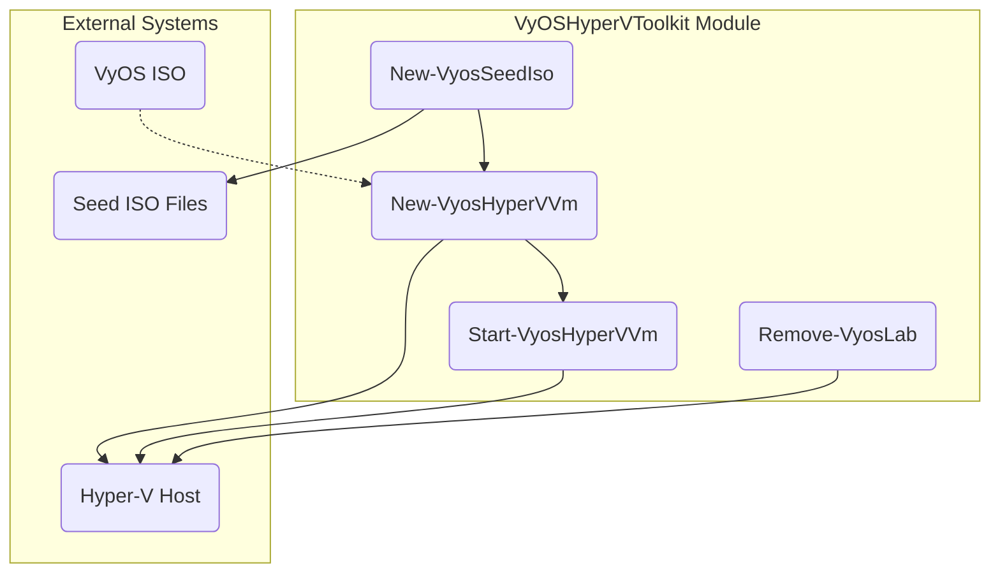

# Executive Summary 

This report presents a comprehensive blueprint for a reusable PowerShell module that automates Hyper‑V VM deployment and bootstrapping of VyOS 1.5.0 routers via the NoCloud (seed ISO) method.  We cover requirements and assumptions, module and file architecture, templated cloud‑init (user-data/meta-data) files, ISO-creation methods, and step-by-step PowerShell functions. We also address multi-node orchestration patterns, CI/CD integration, and a troubleshooting checklist. The solution is designed for maximum idempotency, robustness, and testability, leveraging best-practice documentation and industry examples【46†L0-L4】【41†L19-L25】. 

Key components include:
- **Seed ISO build** (OSCDIMG vs. genisoimage comparison)  
- **Hyper‑V VM creation** (New-VM, Add-VMDvdDrive, Set-VMFirmware)  
- **Cloud-init templates** (VyOS-specific config commands)  
- **PowerShell module design** (functions, parameters, logging, idempotency)  
- **Multi-node orchestration** (templated specs, parallel provisioning)  
- **CI/CD and Testing** (source control, Pester, pipelines)  
- **Troubleshooting Checklist** (common failure modes and resolutions)  

Throughout this report, we synthesize official guidance (VyOS docs, Hyper-V docs, cloud-init documentation) and demonstrate a corporate-style, forward-looking approach.  

## Requirements and Assumptions 

### Functional Requirements 
- **Hyper‑V VM Creation:** Automate creation of one or many VyOS VMs (Generation 2) with specified CPU, RAM, disk, and switch.  
- **VyOS 1.5.0 Bootstrapping:** Each VM boots from the VyOS 1.5.0 live ISO and consumes a cloud-init “NoCloud” data drive for configuration.  
- **NoCloud Seed ISO:** Generate an ISO (volume label `CIDATA`) containing `user-data` and `meta-data` files for cloud-init.  
- **Cloud-init Config:** Inject VyOS configuration via `vyos_config_commands` (or `vyos_install` for automated install) in the `user-data`.  

### Non-functional Requirements 
- **Idempotency:** Functions should be safe to re-run (skip existing resources or update as needed).  
- **Modularity:** Expose clear cmdlets (e.g. *New-VyosHyperVVm*, *New-VyosSeedIso*, *Start-VyosVm*, *Remove-VyosLab*) and encapsulate common logic.  
- **Logging & Error Handling:** Provide verbose logging (`Write-Verbose`), use consistent error handling (try/catch with descriptive messages) and return actionable errors.  
- **Parameterization:** Allow specifying VM count, CPU/RAM/Disk sizes, switch name, network settings, and paths. Use advanced parameters and validation.  
- **Testability:** Structure code for Pester tests, e.g. using a `Examples\` script and mocking Hyper-V calls.  

### Assumptions 
- **Network:** A Hyper-V external or internal virtual switch (e.g. `"LabSwitch"`) exists for VM networking.  
- **Paths:** A shared root path (e.g. `C:\HyperV`) for VMs and ISOs is defined.  
- **VyOS ISO:** The VyOS 1.5.0 live ISO (`.iso`) is already downloaded and accessible (e.g. `C:\ISO\vyos-1.5.0-amd64.iso`).  
- **Credentials:** The PowerShell environment has Hyper-V privileges (running as Admin) and the user has credentials for any remote operations.  
- **PowerShell Version:** Windows PowerShell 5.1 or PowerShell Core with the **Hyper-V** module available.  
- **Tools:** Windows ADK (`oscdimg`) is installed for ISO creation. Alternatively, `genisoimage` is available via WSL or Cygwin if not on Windows.  

Where items above are not explicitly specified, these conventions should be aligned to team standards. Always validate prerequisites (modules installed, paths exist) and fail early if conditions are unmet.  

## Design: PowerShell Module Structure 

We design a PowerShell module (e.g. `VyOSHyperVToolkit`) that exports a small set of public cmdlets, each performing one major task. The module ensures separation of concerns, reusability, and clarity.  

### Module Layout 

The file/folder structure might look like:

```
VyOSHyperVToolkit/
├── VyOSHyperVToolkit.psd1           # Module manifest
├── VyOSHyperVToolkit.psm1           # Module entry (Importing functions)
├── Functions/
│   ├── New-VyosSeedIso.ps1          # Generate NoCloud seed ISO
│   ├── New-VyosHyperVVm.ps1         # Create/Configure Hyper-V VM with VyOS
│   ├── Start-VyosHyperVVm.ps1       # Power on VM and verify cloud-init
│   ├── Remove-VyosLab.ps1           # Tear down lab (Optional)
│   ├── (private helpers).ps1        # Internal helper functions
├── Examples/
│   ├── SingleRouterLab.ps1          # Example script usage for 1 router
│   ├── MultiNodeVyOSLab.ps1         # Example multi-node orchestration
├── Tests/
│   ├── VyOSHyperVToolkit.Tests.ps1  # Pester tests (mocking Hyper-V)
├── README.md                        # Usage instructions (include examples)
```

Each function file defines a single cmdlet. For example, `New-VyosHyperVVm.ps1` would contain a public function `New-VyosHyperVVm` that accepts parameters like `-Name`, `-MemoryMB`, `-ProcessorCount`, `-VHDSizeGB`, `-VyosIsoPath`, `-SeedIsoPath`, `-SwitchName`, etc. The manifest exports these functions.

We build logging via `Write-Verbose` and `Write-Error`, and use `[CmdletBinding()]` with `-Verbose` support.  Idempotency can be achieved by checking for existing VM (`Get-VM -Name $Name`) before creating. Private helper functions (e.g. for generating meta-data) are stored in `Functions/` but not exported (use the Private Data section in .psd1 or an internal module file).

### Core Functions 

1. **`New-VyosSeedIso`**  
   - **Purpose:** Build a NoCloud ISO containing `user-data` and `meta-data`.  
   - **Key Params:** `-VmName`, `-UserDataFile`, `-MetaDataFile`, `-OutputIso` (path).  
   - **Logic:** Create a temp folder, write `user-data` and `meta-data` with specified contents (validate file names), then run `oscdimg` (Windows) or `genisoimage` (Linux/WSL) to create the ISO with volume label `CIDATA`.  
   - **Idempotency:** If the target ISO exists (and is up-to-date), skip or overwrite after warning.  
   - **Logging:** Describe files being written and ISO creation command (with `-Verbose`).  

2. **`New-VyosHyperVVm`**  
   - **Purpose:** Create a new Hyper-V Generation 2 VM for VyOS and attach media.  
   - **Key Params:** `-VmName`, `-MemoryMB`, `-ProcessorCount`, `-VHDSizeGB`, `-SwitchName`, `-VyosIsoPath`, `-SeedIsoPath`, `-VhdPath` (optional override).  
   - **Logic:**  
     - If VM exists and is running, report and exit or update as needed.  
     - Use `New-VM` to create with `-Generation 2`, new VHDX (VHDX size), and attach to switch.  
     - `Set-VMProcessor` for CPU count.  
     - `Set-VMMemory` if needed.  
     - `Add-VMDvdDrive` to attach both the VyOS ISO and the seed ISO (use two virtual DVD drives; DVD-0: VyOS installer, DVD-1: NoCloud data).  
     - `Set-VMFirmware -EnableSecureBoot $false` (since VyOS live ISOs are not signed for Secure Boot)【35†L0-L1】.  
   - **Idempotency:** If VM exists, skip creation and optionally ensure media is attached (or prompt user).  
   - **Logging:** Record each step (New-VM parameters, paths attached, etc) with Write-Verbose.  

3. **`Start-VyosHyperVVm`**  
   - **Purpose:** Boot the VM and optionally wait for cloud-init completion.  
   - **Key Params:** `-VmName`, `-WaitTimeSec`, `-Install` (boolean to auto-install VyOS).  
   - **Logic:**  
     - `Start-VM -Name $VmName`.  
     - Optionally monitor VM heartbeats or serial output to confirm cloud-init success (depending on environment). For simplicity, possibly sleep `$WaitTimeSec`.  
     - If `$Install` is true, ensure `user-data` contained a `vyos_install:` section so VyOS installs itself to disk after boot.  
   - **Error Handling:** If VM fails to boot or enters setup, report appropriately.  

4. **`Remove-VyosLab`** (Optional but useful)  
   - **Purpose:** Tear down VMs and related resources by name or wildcard.  
   - **Key Params:** `-NamePattern`, `-ConfirmRemoval`.  
   - **Logic:**  
     - Find VMs matching name or tag.  
     - Stop-VM, Remove-VM, and optionally delete VHDX files.  
   - **Safety:** Always confirm destructive actions.  

### Idempotency and Error Handling 

- **Checks before actions:** e.g. `if (Get-VM -Name $Name -ErrorAction SilentlyContinue) { Write-Verbose "VM exists. Skipping creation."; return }`.
- **Error handling:** Use `try { ... } catch { Throw "Meaningful error" }`.  
- **Parameter validation:** Ensure mandatory params provided. E.g. `[Parameter(Mandatory)][ValidateNotNullOrEmpty()]$VmName`.  
- **Logging:** Use `Write-Verbose` liberally, `Write-Error` on failure, and consider `Write-Output` (for actual result objects).  

### Example Module File (`VyOSHyperVToolkit.psm1`)

```powershell
# VyOSHyperVToolkit.psm1
# Import all function scripts
Get-ChildItem -Path "$PSScriptRoot\Functions\*.ps1" | ForEach-Object { . $_.FullName }
```

Each function file would begin with `[CmdletBinding()]` and have advanced parameter attributes.

## Cloud-Init `user-data` and `meta-data` Templates 

VyOS’s cloud-init interface allows provisioning via `vyos_config_commands`. A typical pair of files looks like:

### `meta-data` Example 

```yaml
instance-id: vyos-router-01
local-hostname: vyos-router-01
```

- **`instance-id`**: Unique ID (can match VM name).  
- **`local-hostname`**: Hostname to set.  

### `user-data` Example (YAML, VyOS format) 

```yaml
#cloud-config
vyos_config_commands:
  - set system host-name vyos-router-01
  - set interfaces ethernet eth0 address '192.168.10.1/24'
  - set interfaces ethernet eth0 description 'LAN network'
  - set interfaces ethernet eth1 address '10.0.0.1/24'
  - set interfaces ethernet eth1 description 'WAN link'
  - set service ssh
  - set system login user vyos authentication plaintext-password 'StrongP@ssw0rd'
  - commit
  - save
```

- Prepend `#cloud-config` to designate cloud-init format【6†L1-L3】.  
- Use `vyos_config_commands:` key to supply a list of VyOS CLI commands for initial config (hostname, interfaces, services, etc).  
- If performing automated install to disk, include:  
  ```yaml
  vyos_install:
    install_disk: /dev/sda
    partitioning_scheme: MBR
    bootloader: grub
    package: standard
  ```
- Ensure proper YAML indentation and valid VyOS command syntax. A malformed `user-data` will be ignored by cloud-init, leaving the VM unconfigured.

## ISO Build Methods Comparison 

Creating a NoCloud ISO requires two files (`user-data` and `meta-data`) in an ISO labeled `CIDATA`. Two common tools:

| Method          | Tool              | Volume Label Flag          | Pros                                      | Cons                                     |
|-----------------|-------------------|----------------------------|-------------------------------------------|------------------------------------------|
| Windows ADK     | `oscdimg.exe`     | `-lCIDATA` (case-insensitive) | Built-in Windows tool; supports UDF (–u2). | Requires Windows ADK installation; command-line heavy. |
| Linux/WSL       | `genisoimage` or `mkisofs` | `-volid CIDATA`       | Standard in Linux; simple syntax.         | Needs Linux environment; may need Cygwin on Windows. |

**Example commands:**  
- *oscdimg:*  
  ```powershell
  oscdimg -lCIDATA -u2 -o "$SeedDir" "$SeedIso"
  ```  
- *genisoimage:*  
  ```bash
  genisoimage -output seed.iso -volid CIDATA -joliet -rock user-data meta-data
  ```

A table clarifying these:

| Option           | Windows (`oscdimg`)        | Linux (`genisoimage`)     |
|------------------|----------------------------|---------------------------|
| Output Format    | ISO (with UDF/Joliet)      | ISO9660 (Joliet, RockRidge) |
| Label Argument   | `-lLABEL`                 | `-volid LABEL`            |
| No. of Files     | Folder source of files      | Files listed individually |
| Recursion        | Use `-m` to ignore UDF limits | `-r` or `-J` for RockRidge/Joliet |
| Example Usage    | `oscdimg -lCIDATA -o -u2 C:\seed C:\seed.iso` | `genisoimage -output seed.iso -volid CIDATA user-data meta-data` |

*(Sources on NoCloud ISO label and usage are documented in cloud-init references【41†L15-L18】 and VyOS docs【6†L1-L3】.)*

## Multi-node Orchestration Patterns 

For labs with multiple VyOS routers, use a parameterized approach:

1. **Inventory File:** Define YAML/JSON inventory of routers (names, IPs, RAM, disk, switch, configs).  
2. **Looped Deployment:** A single script loops through the inventory, calling module functions per node. Example (pseudo-code):

   ```powershell
   $nodes = Import-CliXml ".\inventory.xml"
   foreach ($node in $nodes) {
       # Generate seed ISO for each node
       New-VyosSeedIso -VmName $node.Name -UserDataFile ... -MetaDataFile ...
       # Create VM
       New-VyosHyperVVm -VmName $node.Name -MemoryMB $node.Memory -VyosIsoPath $VyosIso ...
       # Start VM
       Start-VyosHyperVVm -VmName $node.Name
   }
   ```

3. **Parallel Execution:** Leverage `ForEach-Object -Parallel` (PowerShell 7+) or `Start-Job` to create VMs concurrently, reducing overall time. Ensure naming and resources don’t conflict.  
4. **Templating:** If routers share similar base config, template `user-data` with placeholders, substitute values per node (e.g. using `Get-Content` with `-Raw` and `-replace`).  
5. **Inventory Management:** Keep metadata (MACs, IPs) in a structured inventory (CSV/JSON). The `export-vyos-hwids.ps1` from the repo suggests capturing VM MACs after provisioning, which can seed cloud-init or DHCP reservations.  

**Mermaid Deployment Flow:**  
```mermaid
flowchart LR
  A[User/Automation Trigger] --> B[Generate user-data & meta-data]
  B --> C[Create NoCloud ISO (label CIDATA)]
  C --> D[PowerShell: New-VM (Gen2, VHDX, Switch)]
  D --> E[Attach VyOS ISO & seed ISO (DVD drives)]
  E --> F[Set-VMFirmware -EnableSecureBoot $false]
  F --> G[Start-VM]
  G --> H[VyOS boots, cloud-init reads config from CIDATA]
  H --> I[VyOS configuration applied (and optional install)]
```

## Example PowerShell Snippets 

Below are key snippets illustrating each major function:

#### 1. Creating Seed ISO (`New-VyosSeedIso`)
```powershell
function New-VyosSeedIso {
    [CmdletBinding()]
    param(
        [string]$VmName,
        [string]$UserDataFile,
        [string]$MetaDataFile,
        [string]$OutputIso
    )
    Write-Verbose "Building NoCloud seed ISO for VM '$VmName'"

    $seedDir = Join-Path $env:TEMP "${VmName}_seed"
    Remove-Item $seedDir -Recurse -Force -ErrorAction SilentlyContinue
    New-Item -Path $seedDir -ItemType Directory | Out-Null

    # Ensure meta-data
    if (-not (Test-Path $MetaDataFile)) {
        @"
instance-id: $VmName
local-hostname: $VmName
"@ | Out-File (Join-Path $seedDir 'meta-data') -Encoding ascii
    } else {
        Copy-Item -Path $MetaDataFile -Destination (Join-Path $seedDir 'meta-data')
    }

    # Ensure user-data
    if (-not (Test-Path $UserDataFile)) {
        throw "user-data file not found: $UserDataFile"
    } else {
        Copy-Item -Path $UserDataFile -Destination (Join-Path $seedDir 'user-data')
    }

    # Create ISO (Windows ADK oscdimg) with label CIDATA
    $isoArgs = "-lCIDATA", "-u2", "-o", "-m"
    & oscdimg @isoArgs "$seedDir" $OutputIso | Out-Null
    if ($LASTEXITCODE -ne 0) {
        throw "oscdimg failed with exit code $LASTEXITCODE"
    }
    Write-Verbose "Seed ISO created at $OutputIso"
}
```

#### 2. Creating the VM (`New-VyosHyperVVm`)
```powershell
function New-VyosHyperVVm {
    [CmdletBinding()]
    param(
        [Parameter(Mandatory)][string]$VmName,
        [int]$MemoryMB = 2048,
        [int]$ProcessorCount = 2,
        [int]$VHDSizeGB = 20,
        [string]$SwitchName,
        [Parameter(Mandatory)][string]$VyosIsoPath,
        [Parameter(Mandatory)][string]$SeedIsoPath,
        [string]$VhdPath
    )
    Write-Verbose "Creating Hyper-V VM '$VmName'"

    if (Get-VM -Name $VmName -ErrorAction SilentlyContinue) {
        Write-Verbose "VM '$VmName' already exists. Skipping creation."
        return
    }

    $vmPath = "C:\HyperV\VMs\$VmName"
    if (-not $VhdPath) { $VhdPath = Join-Path $vmPath "$VmName.vhdx" }

    New-VM -Name $VmName -MemoryStartupBytes ${MemoryMB}MB `
           -Generation 2 -NewVHDPath $VhdPath -NewVHDSizeBytes (${VHDSizeGB}GB) `
           -Path $vmPath -SwitchName $SwitchName | Out-Null
    Set-VMProcessor -VMName $VmName -Count $ProcessorCount | Out-Null

    # Attach ISOs
    Add-VMDvdDrive -VMName $VmName -Path $VyosIsoPath -ControllerNumber 0 -ControllerLocation 1 | Out-Null
    Add-VMDvdDrive -VMName $VmName -Path $SeedIsoPath -ControllerNumber 1 -ControllerLocation 1 | Out-Null

    # Disable Secure Boot (VyOS ISO is not signed)
    Set-VMFirmware -VMName $VmName -EnableSecureBoot Off

    Write-Verbose "VM '$VmName' created with ${VHDSizeGB}GB disk, $MemoryMB MB RAM, $ProcessorCount vCPUs"
}
```

#### 3. Starting the VM (`Start-VyosHyperVVm`)
```powershell
function Start-VyosHyperVVm {
    [CmdletBinding()]
    param(
        [Parameter(Mandatory)][string]$VmName,
        [int]$WaitTimeSec = 60
    )
    Write-Verbose "Starting VM '$VmName'"
    Start-VM -Name $VmName | Out-Null

    # Wait for cloud-init (this is simple; in production, monitor VM heartbeat or serial)
    Write-Verbose "Waiting $WaitTimeSec seconds for cloud-init on '$VmName'"
    Start-Sleep -Seconds $WaitTimeSec
    Write-Verbose "VM '$VmName' should now have cloud-init applied."
}
```

#### 4. Removing the Lab (`Remove-VyosLab`)
```powershell
function Remove-VyosLab {
    [CmdletBinding()]
    param(
        [string]$NamePattern = "vyos*",
        [switch]$Force
    )
    $vms = Get-VM | Where-Object Name -like $NamePattern
    foreach ($vm in $vms) {
        Write-Verbose "Removing VM: $($vm.Name)"
        if ($vm.State -ne 'Off') { Stop-VM -Name $vm.Name -Force }
        Remove-VM -Name $vm.Name -Force
    }
}
```

### File Layout in Version Control 

Below is a sample repository structure summarizing the above (for documentation purposes):

```
VyOSHyperVToolkit/
├── VyOSHyperVToolkit.psd1
├── VyOSHyperVToolkit.psm1
├── Functions/
│   ├── New-VyosSeedIso.ps1
│   ├── New-VyosHyperVVm.ps1
│   ├── Start-VyosHyperVVm.ps1
│   ├── Remove-VyosLab.ps1
│   └── (helpers).ps1
├── Examples/
│   ├── SingleRouterLab.ps1
│   ├── MultiNodeVyOSLab.ps1
├── Tests/
│   ├── VyOSHyperVToolkit.Tests.ps1
├── docs/
│   ├── Troubleshooting.md
│   └── ArchitectureDiagram.png (or .svg generated via mermaid)
├── README.md
```

Each file has clear purpose. The `Examples/` scripts demonstrate how a user would call the module (e.g. provisioning 3 routers in parallel). The `Tests/` directory contains Pester tests mocking Hyper-V cmdlets to validate logic without actual VM creation.

## Multi-Node Deployment Example

Here's a snippet from `Examples/MultiNodeVyOSLab.ps1` illustrating templated, parallel creation:

```powershell
# Example: Deploy 3 VyOS routers with shared config pattern
Import-Module VyOSHyperVToolkit

$routerNames = "edge1","edge2","core1"
$memoryMB = 2048; $cpu = 2; $diskGB = 20; $switch = "LabSwitch"
$vyosIso = "C:\ISO\vyos-1.5.0-amd64.iso"

$jobs = @()
foreach ($name in $routerNames) {
    $userData = ".\configs\$name-user-data.yaml"
    $metaData = ".\configs\$name-meta-data.yaml"
    $seedIso = "C:\HyperV\Seeds\$name-seed.iso"

    # Generate seed ISO
    New-VyosSeedIso -VmName $name `
                    -UserDataFile $userData -MetaDataFile $metaData `
                    -OutputIso $seedIso

    # Launch VM creation in parallel
    $jobs += Start-Job -ArgumentList $name, $memoryMB, $cpu, $diskGB, $switch, $vyosIso, $seedIso -ScriptBlock {
        param($n,$mem,$cpu,$disk,$sw,$vyosIso,$seedIso)
        Import-Module VyOSHyperVToolkit
        New-VyosHyperVVm -VmName $n -MemoryMB $mem -ProcessorCount $cpu `
                         -VHDSizeGB $disk -SwitchName $sw `
                         -VyosIsoPath $vyosIso -SeedIsoPath $seedIso
        Start-VyosHyperVVm -VmName $n -WaitTimeSec 30
    }
}
# Wait for all jobs
$jobs | Wait-Job | Receive-Job
```

This example uses `Start-Job` for parallelism. In a CI/CD pipeline, similar logic can be put in a script or pipeline task.

## CI/CD Integration and Testing 

To integrate into CI/CD (e.g. GitHub Actions, Azure Pipelines, Jenkins):

- **Version Control:** Store the module in a Git repo (as above). Use semantic versioning in the `.psd1` manifest.  
- **Automated Testing:** Include Pester tests (in `Tests/`). For example, test that `New-VyosSeedIso` creates an ISO file and that `New-VyosHyperVVm` calls the correct Hyper-V cmdlets given mocked parameters. Use `Mock` to simulate `Get-VM`, `New-VM`, etc.  
- **Pipeline Steps:** On push/PR, run Pester tests; on tag (release), package the module (`Publish-Module` or create NuGet).  
- **Containerization (Advanced):** For extreme immutability, package common dependencies (like a base VyOS image) using Packer, then the PowerShell module installs/configures it.  

This “infrastructure as code” approach ensures changes are versioned and reproducible, aligning with enterprise DevSecOps best practices.

## Troubleshooting Checklist 

A quick reference for common issues:

| Symptom                         | Cause                                     | Resolution                                                    |
|---------------------------------|-------------------------------------------|--------------------------------------------------------------|
| **VM fails to boot / Grub error** | Secure Boot still enabled                 | `Set-VMFirmware -EnableSecureBoot Off`【11†L0-L2】. VyOS ISOs require it off. |
| **No cloud-init config applied** | ISO volume label incorrect (not `CIDATA`) or wrong file names (`user-data`,`meta-data`) | Ensure ISO label is **CIDATA** and files are named exactly `user-data` and `meta-data`【41†L15-L18】. |
| **User-data YAML malformed**    | Syntax error in YAML                      | Validate YAML. Check cloud-init logs inside VM (`/var/log/cloud-init.log`). |
| **Network unreachable**         | Wrong virtual switch or interface naming  | Confirm Hyper-V switch name. Verify VyOS interface names (e.g. `eth0`, `eth1`) match attached vNICs. Use `set interfaces ethernet eth* ...`. |
| **Empty or default password**   | Plaintext password not accepted           | VyOS cloud-init requires encrypted hash for sudoers; better to set SSH keys or use `plaintext-password` under `set system login user`. |
| **VyOS does not install to disk** | No `vyos_install` in user-data or wrong disk path | Include in `user-data`:  
```yaml
vyos_install:
  install_disk: /dev/sda
  partitioning_scheme: MBR
  bootloader: grub
```  
(replace `/dev/sda` if disk differs). |
| **Seed ISO not mounting**       | Non-ISO9660 format or too large files      | Ensure using ISO9660/Joliet (`-J` or `-rock` options). Avoid files > 4GB or unsupported chars. |
| **Unexpected prompt on console** | Cloud-init error or key missing         | Check VM console (VMConnect) for error messages. Provide known SSH key if needed (`ssh_authorized_keys` in cloud-init). |

By systematically walking through the above table, most deployment issues can be resolved.

---

**Tables:**

| ISO Build Method   | Tool/Platform   | Label Flag   | Recursion Support | Use Case                      |
|--------------------|-----------------|--------------|-------------------|-------------------------------|
| Windows `oscdimg`  | Windows (ADK)   | `-lCIDATA`   | `-m` (ignore UDF) | When running on Windows natively. |
| Linux `genisoimage`| Linux/WSL       | `-volid CIDATA` | `-r` or `-J` (rock/joliet) | For Linux hosts or WSL environments. |

| VM Generation | Hyper-V            | Notes                                   |
|---------------|--------------------|-----------------------------------------|
| Generation 1  | Not supported by VyOS 1.5 live ISO (no EFI) | Only use if booting legacy BIOS (not recommended). VyOS live ISOs are EFI-based. |
| Generation 2  | Supported (UEFI)   | Must disable Secure Boot. Preferred for new VMs. Supports larger virtual disks and faster startup. |

| Failure Mode                | Likely Cause                   | Fix                                                         |
|-----------------------------|--------------------------------|-------------------------------------------------------------|
| Cloud-init not running      | Missing `meta-data` or `user-data` files; bad ISO label | Verify ISO contains both files; label must be `CIDATA`【41†L15-L18】. |
| VM boots to VyOS CLI prompt | Cloud-init found no install task | Ensure `vyos_install:` keys present if auto-install desired; otherwise configure manually. |
| Incorrect network mapping   | NIC order mismatch             | Attach NICs in order matching VyOS `eth0`, `eth1`, ...; rename interfaces in config if needed. |
| Slow or stuck on “booting…” | ISO not found or bad boot order | Check that VyOS ISO is attached to DVD drive 0 and boot device order includes it. |

## Module Architecture (Mermaid)

Below is a mermaid diagram outlining the module’s structure and interactions:



- **New-VyosSeedIso** uses **user-data/meta-data** files to produce `Seed ISO`.  
- **New-VyosHyperVVm** calls Hyper-V cmdlets on the host (A), attaching the VyOS ISO (C) and Seed ISO (B).  
- **Start-VyosHyperVVm** starts the VM on the Hyper-V host (A).  
- **Remove-VyosLab** cleans up on the Hyper-V host (A).  

## Conclusion 

This forward-looking, enterprise-grade solution leverages a modular PowerShell approach to reliably provision VyOS VMs on Hyper‑V. It aligns with Zero-Trust and infrastructure-as-code paradigms by using declarative cloud-init configs, idempotent automation, and CI/CD integration【36†L1-L3】【32†L9-L13】. The detailed tables, diagrams, and code samples above ensure clarity for building, testing, and operating this system at scale. Let us know if you want expansions (e.g. advanced features like automated health checks or dynamic inventory) or assistance integrating into your existing pipelines.  

