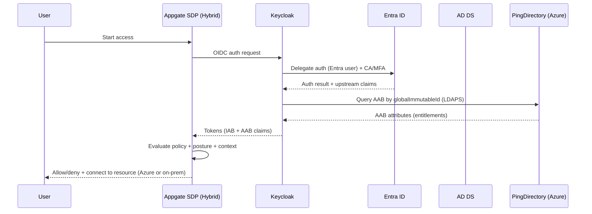

# Technical System Design: Appgate SDP + Keycloak + Entra ID + AD + PingDirectory (Azure) + Appgate (Hybrid) + ExpressRoute

**Version:** 1.3 (ExpressRoute locked)  
**Date:** 2026-02-20  
**Audience:** Engineering + IAM + Security (DoD RMF / NIST 800-53 aligned)

---

## 1. Overview

This design enables **SSO and attribute-driven Zero Trust access** for identities originating in **Microsoft Entra ID** and **on‑prem Active Directory**, while enforcing access via **Appgate SDP** to protected resources in **Azure and on‑prem**.

**Core posture**
- **Appgate trusts Keycloak as the only IdP** (OIDC preferred, SAML fallback).
- **Keycloak is authoritative for the normalized Identity Attribute Bag (IAB)**.
- **PingDirectory (Azure) is authoritative for the Access Attribute Bag (AAB)** used in Appgate policy decisions.
- **Appgate is deployed in both Azure and on‑prem**, placing Gateways near protected resources.
- **ExpressRoute Private Peering is the standard transport** between Azure and on‑prem.

---

## 2. Deployment Footprint

### 2.1 Azure
- **Keycloak**: VM cluster behind Azure Application Gateway (TLS) + PostgreSQL HA
- **PingDirectory**: cluster across Availability Zones (AAB authoritative store)
- **Appgate**: Controllers in Azure (HA) + Azure Gateways for Azure-hosted protected services
- **Shared services**: Key Vault, monitoring/SIEM, private DNS

### 2.2 On‑prem
- **Appgate Gateways** close to on‑prem protected resources (RDP/SSH/web/APIs)
- **AD DS** as upstream identity source
- Optional: **Appgate Controllers** on‑prem if RTO/RPO requires surviving Azure-region loss

---

## 3. Connectivity Architecture: ExpressRoute (locked)

### 3.1 ExpressRoute baseline
- **ExpressRoute Private Peering** provides private IP connectivity between on‑prem and Azure VNets.
- **BGP route exchange** advertises on‑prem prefixes to Azure and Azure prefixes to on‑prem.
- Objective: eliminate public Internet dependency for mission paths (auth, attribute lookups, policy enforcement, and access flows).

### 3.2 Resiliency recommendations
- **Dual ExpressRoute circuits** (or dual peering locations) to mitigate circuit/provider failure.
- **Zone-redundant ExpressRoute Gateway** where supported.
- Route convergence and health monitoring (BGP session state, prefixes received/advertised).

### 3.3 Routing and segmentation guardrails
- Use **dedicated transit VNets / hub-spoke** (or existing enterprise pattern) to control propagation.
- Apply **route filters / UDRs** to prevent unintended reachability (least privilege at the network layer).
- Prefer **private endpoints** (where applicable) for PaaS components; otherwise restrict to private address space and NSGs.

### 3.4 DNS (often the silent killer)
- Establish a clear DNS design for:
  - Keycloak issuer URLs
  - Appgate controller/gateway discovery endpoints
  - PingDirectory LDAPS endpoints
- Prefer split-horizon DNS or private DNS zones with conditional forwarding.
- Ensure certificate SANs match the chosen private FQDNs.

---

## 4. Core Components

- **Appgate SDP**: Policy enforcement + connectivity to protected resources (Azure + on‑prem).
- **Keycloak (Azure VMs)**: Single IdP to Appgate; brokers upstream auth; authoritative IAB normalization; token issuer.
- **Microsoft Entra ID**: Upstream IdP for many users; enforces Conditional Access + MFA at initial authentication.
- **Active Directory (on‑prem)**: Upstream identity source for other users.
- **PingDirectory (Azure)**: Authoritative AAB store (entitlements/access attributes).

---

## 5. Attribute Model

### 5.1 IAB (Identity Attribute Bag) — authoritative in Keycloak
Standard “everyone gets these” attributes, normalized in Keycloak (name, country, clearance types, valid‑until, etc.).

**Guardrails**
- Upstream attributes are **read-only inputs**.
- Keycloak owns normalization, schema, and audit traceability (origin + timestamp).

### 5.2 AAB (Access Attribute Bag) — authoritative in PingDirectory (Azure)
Aggregated entitlement attributes used by Appgate policies.

**Recommended PingDirectory schema**
- Key: `globalImmutableId`
- Core: `roles`, `resourceBundles`, `envScopes`, `stepUpRequired`, `sessionMaxMinutes`, `geoConstraints`, `clearanceConstraints`, `timeWindows`
- Governance: `aabSchemaVersion`, `lastUpdatedBy`, `lastUpdatedAt`

---

## 6. Identity Linking Without UPN

Selected:
- Immutable: `immutableId` / `onPremisesImmutableId` (Entra)
- Secondary: `extensionAttribute01`

### 6.1 Reality check
AD does **not** have `immutableId` natively. To avoid drift, stamp the same immutable anchor into AD via a **write-once AD attribute** (extension attribute or custom schema).

### 6.2 Recommended canonical anchor
Define a canonical anchor in Keycloak:
- **`globalImmutableId`** (UUID)

**Mapping**
- Entra → Keycloak: `immutableId` → `globalImmutableId`
- AD → Keycloak: AD write-once attribute → `globalImmutableId`
- PingDirectory AAB uses `globalImmutableId` as its primary key.

**Secondary**
- `extensionAttribute01` retained for correlation safety and migration scenarios.

---

## 7. Authentication and Assurance

### 7.1 Protocols
- **OIDC** Keycloak → Appgate (preferred)
- **SAML** Keycloak → Appgate (fallback)

### 7.2 Assurance signals (MFA/CA/risk/device)
Intent:
- Entra CA/MFA at initial login (for Entra-origin identities)
- Step-up when requesting sensitive resources via Appgate policy

**Design requirement**
- Define a claims contract that includes assurance state when policy depends on it.
- Don’t let “best effort” claims drive high-trust entitlements.

---

## 8. Provisioning, Sync, and Revocation (<60 seconds)

### 8.1 Entra → Keycloak (SCIM push)
- SCIM is the primary near-real-time channel for Entra-origin identities and group signals.

### 8.2 AD → Keycloak (LDAP federation + scheduled sync)
- LDAP federation/sync alone is not reliably event-driven → not consistently <60 seconds.

### 8.3 Recommended sub-minute revocation strategy
**Combine short-lived tokens + event-driven session kill**.

- **Entra-origin**
  - SCIM disable + Keycloak Admin API: disable user + revoke sessions
- **AD-origin**
  - **AD Change Event Bridge**: disable/delete/group-change → Keycloak disable + revoke sessions

This makes the SLA real and auditable.

---

## 9. AAB Enrichment (PingDirectory in Azure)

### 9.1 Token-time enrichment (recommended starting point)
- Keycloak queries PingDirectory during token issuance (mapper/SPI) using `globalImmutableId`.
- Pros: freshest entitlements at decision time
- Cons: dependency/latency; requires strong PingDirectory HA and timeouts

**ExpressRoute impact**
- Private peering reduces latency variance and improves availability compared to VPN/Internet.
- Still enforce strict timeouts and circuit-breaker behavior (deny-by-default for high-trust enclaves).

### 9.2 Caching (optional later)
- Cache only low-risk/slow-changing attributes.
- Do not cache “revocation-critical” entitlements unless invalidation still meets SLA.

---

## 10. Appgate Hybrid Placement (Azure + On‑prem)

### 10.1 Controllers
- Primary: Controllers in Azure (HA).
- Optional: Controllers on‑prem if RTO/RPO demands surviving Azure-region loss.

### 10.2 Gateways (data plane)
- Azure Gateways for Azure-hosted resources; On‑prem Gateways for on‑prem resources.
- Keep routing simple: user → Appgate → gateway near resource → resource.

### 10.3 Failure modes to design explicitly
- ExpressRoute impairment (reconvergence/partial route loss)
- PingDirectory unreachable (token-time enrichment fails)
- On‑prem isolation (Azure reachable but on‑prem resources not)

Document degraded-mode rules explicitly; for DoD high-trust enclaves, default to **deny** when assurance is uncertain.

---

## 11. Token/Session Baseline (Lab)
Starting recommendations:
- Access token: **5 minutes**
- ID token: **5–10 minutes**
- Refresh token: **30–60 minutes**, rotated
- Max SSO session: **8–12 hours** (lower for high-trust enclaves)
- Step-up: enforce via re-auth gates and shorter sessions for sensitive resources

---

## 12. High Availability and DR

### 12.1 Keycloak on Azure VMs
- 2–3 nodes across AZs behind Application Gateway
- External DB: PostgreSQL HA
- Secrets: Key Vault
- Observability: auth events, LDAP latency, token issuance errors

### 12.2 PingDirectory in Azure
- Cluster across AZs
- AAB writes restricted to entitlement pipeline (least privilege)
- Monitor: LDAPS latency, bind failures, replication health

### 12.3 ExpressRoute
- Dual circuits/peering locations recommended
- Monitor BGP and route propagation (change control required)
- Run failover drills (brownouts happen more often than total outages)

### 12.4 Appgate hybrid
- Controllers HA in Azure; Gateways in both Azure and on‑prem
- Decide whether controllers require multi-region survivability based on RTO/RPO

---

## 13. Security/Compliance Notes (DoD RMF / NIST 800-53)
- AU: correlated audit trail (Appgate policy decisions + Keycloak auth + PingDirectory reads + upstream IdP events)
- AC/IA: attribute-driven access; strong authentication; step-up for sensitive resources
- SC/CM: TLS everywhere, hardened VM baselines, config control, and documented failover/testing

---

# Mermaid Diagrams

## A) Overview Architecture

```mermaid
flowchart TB
  U[User] --> KC[Keycloak (Azure VMs)
Single IdP for Appgate]
  KC -->|OIDC preferred| APPG[Appgate SDP (Hybrid)
Controllers + Gateways]
  KC -.->|SAML fallback| APPG

  subgraph Upstream_Identity
    EN[Microsoft Entra ID
CA/MFA]:::idp
    AD[On‑prem AD DS]:::idp
  end

  subgraph Azure_Attributes
    PD[PingDirectory (Azure)
AAB Authoritative]:::dir
    IAB[(Keycloak IAB
Normalized Identity Bag)]:::store
  end

  ER[ExpressRoute
Private Peering]:::net

  APPG --> AZRES[Azure Protected Resources
(web/ssh/rdp/apis)]:::res
  APPG --> ONRES[On‑prem Protected Resources
(web/ssh/rdp/apis)]:::res

  KC --> EN
  KC --> AD
  KC --> IAB
  KC -->|LDAPS lookup / mapper| PD

  KC --- ER --- AD
  APPG --- ER --- ONRES

  classDef idp fill:#eef,stroke:#99f;
  classDef dir fill:#efe,stroke:#9c9;
  classDef store fill:#ffe,stroke:#cc9;
  classDef res fill:#fef,stroke:#c9c;
  classDef net fill:#eef,stroke:#666,stroke-dasharray: 5 5;
```

## B) System Flow (Auth + AAB Enrichment + Appgate Decision)



## C) Component Diagram (Azure-first IAM + Hybrid Appgate + ExpressRoute)

```mermaid
flowchart LR
  subgraph Azure
    AGW[Azure App Gateway
TLS] --> KC1[Keycloak VM #1]
    AGW --> KC2[Keycloak VM #2]
    KC1 --- PG[(PostgreSQL HA)]
    KC2 --- PG
    KC1 --- KV[Key Vault]
    KC2 --- KV

    PD1[PingDirectory #1] --- PD2[PingDirectory #2]
    PD2 --- PD3[PingDirectory #3 (opt)]
    APPGC[Appgate Controllers (Azure)
HA]:::app
    APPGG_AZ[Appgate Gateways (Azure)]:::app
  end

  subgraph On_Prem
    ADDS[AD DS]:::idp
    APPGG_OP[Appgate Gateways (On‑prem)]:::app
    ONRES[On‑prem Resources]:::res
  end

  ENTRA[Entra ID]:::idp
  AZRES[Azure Resources]:::res
  ER[ExpressRoute
Private Peering]:::net

  KC1 --> ENTRA
  KC1 --> PD1
  KC1 --- ER --- ADDS

  APPGC --> APPGG_AZ --> AZRES
  APPGC --> APPGG_OP --- ER --- ONRES

  classDef idp fill:#eef,stroke:#99f;
  classDef app fill:#fef,stroke:#c9c;
  classDef res fill:#fff,stroke:#999;
  classDef net fill:#eef,stroke:#666,stroke-dasharray: 5 5;
```

---

## Appendix: Implementation backlog deltas (ExpressRoute)
- Confirm ER topology (dual circuits/peering locations, gateway SKU, route propagation model).
- Define DNS + certificate strategy for private endpoints/FQDNs.
- Document network least-privilege rules (NSGs/UDRs/firewalls) for Keycloak↔PingDirectory↔Appgate flows.
- Add operational runbooks: BGP health, failover drills, and degraded-mode policy behavior.
