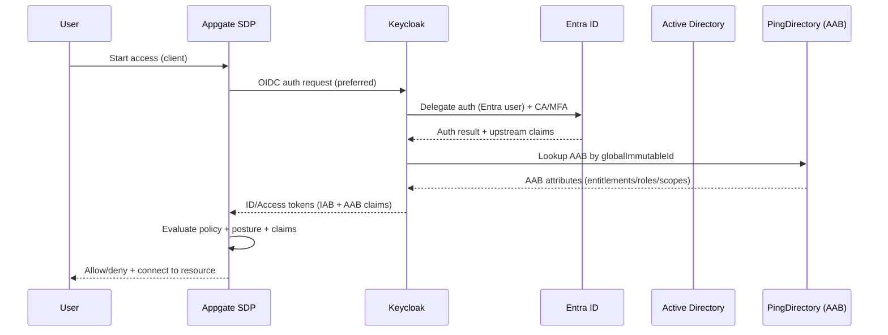

# Technical System Design: Appgate SDP + Keycloak + Entra ID + AD + PingDirectory

**Version:** 1.1 (VM + PingDirectory update)  
**Date:** 2026-02-20  
**Audience:** Engineering + IAM + Security (DoD RMF / NIST 800-53 aligned)

---

## 1. Overview

This design enables **single sign-on (SSO)** for users originating in **Microsoft Entra ID** and **on‑premises Active Directory**, while enforcing **attribute-driven Zero Trust access** via **Appgate SDP**.

**Key principle:** Appgate SDP trusts **Keycloak as the one and only IdP**. Keycloak brokers upstream authentication from Entra and AD and becomes authoritative for a standardized **Identity Attribute Bag (IAB)**. A separate authoritative store (**PingDirectory**) provides an **Access Attribute Bag (AAB)** used for Appgate access policy decisions.

---

## 2. Goals and Non-goals

### Goals
- One IdP to Appgate (**OIDC preferred**, SAML fallback).
- Two independent upstream identity sources (**Entra and AD**), **no sync** between them.
- **No UPN** linking. Use two attributes for linking: one immutable “write once” and one secondary.
- **< 60 seconds** deprovisioning/revocation target where feasible.
- DoD RMF / NIST 800-53 supportability: logging, traceability, least privilege, and auditable decisions.

### Non-goals
- Replacing upstream IAM lifecycle systems (HR/IGA). This design assumes an upstream joiner/mover/leaver process exists.
- Building a full attribute governance program (but we define guardrails needed for one).

---

## 3. Core Components

- **Appgate SDP**: Policy enforcement + access plane to protected resources (web, SSH, RDP, APIs, etc.).
- **Keycloak (on Azure VMs)**: Single IdP to Appgate; brokering upstream authentication; authoritative IAB store; token issuer.
- **Microsoft Entra ID**: Upstream IdP for many users; enforces Conditional Access and MFA for initial authentication.
- **On-prem AD DS**: Upstream identity source for other users; authenticates via LDAP/Kerberos/ADFS patterns depending on config.
- **PingDirectory**: Authoritative AAB store (entitlement/access attributes) used for Appgate policies.
- **Supporting**: Azure Application Gateway, PostgreSQL (Keycloak DB), Key Vault, logging/SIEM.

---

## 4. Identity Data Model

### 4.1 Identity Attribute Bag (IAB) — authoritative in Keycloak
**Definition:** “Standard set of attributes that the source of truth provides to everyone” (name, country, clearance type(s), valid‑until, etc.).

**Rule:** Keycloak is authoritative for the **normalized representation** of these attributes, even if mastered upstream.

**Implementation notes**
- Normalize attribute naming and types in Keycloak (e.g., `clearances: [..]`, `clearanceValidUntil: date`).
- Treat upstream attributes as read-only inputs; enforce strict admin/API boundaries on IAB mutation.
- Keep an audit trail: attribute origin, last refresh time, and last change actor/system.

### 4.2 Access Attribute Bag (AAB) — authoritative in PingDirectory
**Definition:** Aggregated attributes required for **SDP policy** (entitlements, resource bundles, environment scopes, mission roles, etc.).

**Recommendation (PingDirectory model)**
- Create an **AAB entry per identity** (or per identity + environment) with:
  - `globalImmutableId` (anchor)
  - Entitlement attributes (roles, resource groups, clearance gating, time constraints)
  - Optional “policy hints” (step‑up required, max session, geo restrictions)
- Use PingDirectory **as the authoritative store** and treat Keycloak as a consumer/enricher.
- Prefer a **stable schema** and version it (`aabSchemaVersion`).

---

## 5. Identity Linking Without UPN

You selected:
- Immutable attribute: **`immutableId` / `onPremisesImmutableId`** (Entra terminology)
- Secondary attribute: **`extensionAttribute01`**

### 5.1 Tell-it-like-it-is constraint
**AD does not natively have `immutableId`.** If you truly need the same immutable anchor across Entra + AD, you must store the anchor in AD in a **write-once attribute** (Exchange extension attributes, custom schema, or another controlled attribute).

### 5.2 Canonical approach (recommended)
Define a canonical Keycloak attribute:
- **`globalImmutableId`** (UUID or base64 GUID form)

**Mapping**
- Entra → Keycloak: `immutableId` (or `onPremisesImmutableId`) → `globalImmutableId`
- AD → Keycloak: AD write-once attribute (e.g., `extensionAttribute15` or custom `globalImmutableId`) → `globalImmutableId`

**Secondary correlation**
- Keep `extensionAttribute01` as a secondary key for migration safety and to survive rename/email changes.

### 5.3 Write-once governance (recommendation)
- Use an upstream lifecycle authority (IGA / provisioning workflow) to **mint** `globalImmutableId` at identity creation.
- Stamp it into:
  - Entra: `immutableId`
  - AD: selected write-once attribute
  - PingDirectory AAB: `globalImmutableId`
- Enforce **write-once** with:
  - attribute ACLs + workflow-only mutation
  - periodic integrity checks (alerts if mutated)

---

## 6. Authentication Model

### 6.1 OIDC preferred, SAML fallback
- **Primary**: Keycloak OIDC → Appgate SDP
- **Fallback**: Keycloak SAML → Appgate SDP if OIDC constraints appear

### 6.2 Upstream authentication brokering
- Keycloak acts as the authentication front door.
- For Entra users, Keycloak delegates auth to Entra (OIDC/SAML upstream).
- For AD users, Keycloak uses LDAP federation and/or an upstream IdP pattern (depending on your AD auth design).

### 6.3 Assurance (MFA / Conditional Access / Risk)
Your intent:
- **Entra CA/MFA** for initial authentication
- **Appgate step-up** for certain resources

**Design guardrail**
- Decide which “assurance signals” must be present in Keycloak tokens (device compliance, risk level, MFA performed).
- Implement a claims model with explicit trust boundaries (avoid “best effort” claims in high-trust environments).

---

## 7. Provisioning, Sync, and Revocation (<60 seconds target)

### 7.1 Entra → Keycloak (SCIM push)
- Use SCIM to provision users and groups into Keycloak.
- Push key attributes including the immutable anchor and secondary attribute.
- Keep SCIM as the primary near-real-time channel for Entra-origin identities.

### 7.2 AD → Keycloak (LDAP federation + scheduled sync)
- LDAP federation is read-only and often **not** event-driven.
- Scheduled sync is fine for “eventual consistency” but will **not** reliably meet <60 seconds.

### 7.3 Recommendation for sub-minute deprovisioning
Use a two-pronged strategy:
1. **Short-lived tokens/sessions** (limits the damage window)
2. **Event-driven revocation** (kills active sessions immediately)

**Entra-origin**
- SCIM update (disable) + Keycloak Admin API: disable user + kill sessions

**AD-origin**
- Add an **AD Change Event Bridge** (small service) that detects:
  - account disable/delete
  - group membership changes relevant to entitlement
  - clearance validity changes
- Bridge triggers:
  - Keycloak Admin API: disable user, revoke sessions
  - Optional: invalidate cached AAB in Keycloak if you cache it

This is how you make <60 seconds real instead of aspirational.

---

## 8. AAB Enrichment Using PingDirectory

### 8.1 Runtime enrichment options
**Option A (recommended): token-time lookup**
- Keycloak performs LDAP lookup(s) to PingDirectory during token issuance or via a custom mapper/SPI.
- Pros: freshest AAB at auth time
- Cons: adds dependency/latency; requires robust PingDirectory HA

**Option B: staged cache into Keycloak**
- Sync AAB periodically into Keycloak user attributes.
- Pros: faster tokens; reduced runtime dependency
- Cons: stale window; must align with <60 second revoke expectations

### 8.2 Recommendation
- Start with **Option A** for correctness and governance.
- Add **selective caching** only for attributes that do not require near-real-time accuracy.

---

## 9. Token, Session, and Claim Defaults (Lab Baseline)

Recommended starting point (tune per environment):
- **ID token**: 5–10 minutes
- **Access token**: 5 minutes (shorter for higher-risk environments)
- **Refresh token**: 30–60 minutes, rotated
- **Max SSO session**: 8–12 hours (lower for high-trust enclaves)
- **Step-up**: force re-auth for sensitive resources via Appgate policy gates and short lifetimes

**Why:** short tokens + event-driven session kill is the pragmatic path to <60 seconds revoke.

---

## 10. High Availability and DR

### 10.1 Keycloak on Azure VMs
**Topology**
- 2–3 Keycloak nodes across **Availability Zones**
- Fronted by **Azure Application Gateway** (TLS termination and health probes)
- External database: **Azure Database for PostgreSQL Flexible Server (HA)**

**Operational**
- Immutable images + config-as-code (Ansible/Terraform)
- Secrets in Key Vault (client secrets, DB creds, signing keys strategy)
- Central logging + metrics (auth events, token errors, LDAP timeouts)

### 10.2 PingDirectory
- Run PingDirectory in HA (clustered) across zones.
- Define strict ACLs for AAB writes (only authorized entitlement pipeline).
- Add monitoring for LDAP latency/errors (because tokens depend on it).

### 10.3 DR considerations
- Define RPO/RTO explicitly; the architecture supports active/active or active/passive depending on budget.
- If mission requires it, replicate Keycloak DB + PingDirectory across regions, and rehearse failover.

---

## 11. Security Controls Mapping (NIST 800-53 lens)

This design supports:
- **AC (Access Control)**: attribute-driven entitlements and least privilege via Appgate policies
- **IA (Identification & Authentication)**: centralized auth flow via Keycloak; MFA/CA via Entra
- **AU (Audit and Accountability)**: correlated logs across Appgate + Keycloak + PingDirectory + upstream IdPs
- **SC (System & Comms Protection)**: TLS everywhere; controlled admin planes; strong key management
- **CM/CA**: config control for VM builds, baselines, and continuous monitoring

(Implementation requires a formal control implementation statement per environment.)

---

## 12. Key Risks and Mitigations

1. **Identity linking drift across Entra and AD**
   - Mitigation: canonical `globalImmutableId`, write-once governance, integrity monitoring

2. **Sub-minute deprovisioning not met for AD**
   - Mitigation: AD Change Event Bridge + session kill + short tokens

3. **PingDirectory dependency impacts auth if it’s on the token path**
   - Mitigation: HA PingDirectory + timeouts/fallback behavior + selective caching

4. **Assurance claims not consistently available**
   - Mitigation: explicit claims contract, test matrix, and policy guardrails

---

# Mermaid Diagrams

## A) Overview Architecture

```mermaid
flowchart TB
  user[User] --> kc[Keycloak (Azure VMs)
Single IdP for Appgate]
  kc -->|OIDC (preferred)| appgate[Appgate SDP
Policy + Access]
  kc -.->|SAML (fallback)| appgate

  subgraph Upstream_Identity_Sources
    entra[Microsoft Entra ID
MFA/Conditional Access]:::idp
    ad[On‑Prem Active Directory]:::idp
  end

  subgraph Attribute_Stores
    pd[PingDirectory
Access Attribute Bag (AAB)]:::dir
    iab[(Keycloak IAB
Identity Attribute Bag)]:::store
  end

  kc --> entra
  kc --> ad
  kc --> iab
  kc -->|LDAP lookup / mapper| pd

  classDef idp fill:#eef,stroke:#99f;
  classDef dir fill:#efe,stroke:#9c9;
  classDef store fill:#ffe,stroke:#cc9;
```

## B) System Flow (Auth + Enrichment + Decision)



## C) Component Diagram (VM-based Keycloak + PingDirectory)

```mermaid
flowchart LR
  subgraph Azure
    AGW[Azure Application Gateway
TLS + Health Probes]
    subgraph Keycloak_Cluster[Keycloak Cluster (VMs)]
      KC1[Keycloak VM #1]
      KC2[Keycloak VM #2]
      KC3[Keycloak VM #3 (optional)]
    end
    PG[(Azure Database for PostgreSQL
HA)]
    KV[Azure Key Vault
Secrets/Keys]
  end

  subgraph On_Prem
    ADDS[AD DS]
  end

  ENTRA[Microsoft Entra ID]:::idp
  PD[PingDirectory Cluster
AAB Authoritative]:::dir
  APPG[Appgate SDP]:::app

  APPG -->|OIDC| AGW --> KC1
  AGW --> KC2
  AGW --> KC3
  KC1 --- PG
  KC2 --- PG
  KC3 --- PG
  KC1 --- KV
  KC2 --- KV
  KC3 --- KV

  KC1 --> ENTRA
  KC1 --> ADDS
  KC1 --> PD

  classDef idp fill:#eef,stroke:#99f;
  classDef dir fill:#efe,stroke:#9c9;
  classDef app fill:#fef,stroke:#c9c;
```

---

## Appendix: Implementation Backlog (starter)
- Define the canonical attribute contract (`globalImmutableId`, IAB schema, AAB schema).
- Pick the AD write-once attribute location (schema + ACLs).
- Build AD Change Event Bridge (disable/delete/group-change → Keycloak session kill).
- Define token claims + Appgate policy mapping.
- HA deployment runbooks for Keycloak VMs + PingDirectory.
