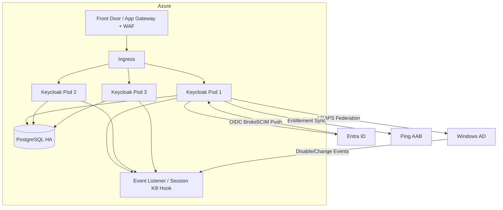

# Appgate SDP + Keycloak + Entra ID + Windows AD
## Technical System Design (TSD)

**Date:** 2026-02-20  
**Target audience:** Platform Engineering, IAM, Security Engineering, Network Engineering  
**Status:** Draft for architecture review (assumptions called out)

---

## 1. Executive overview

This design establishes **Keycloak as the single Identity Provider (IdP) presented to Appgate SDP** while enabling users originating from **Azure Entra ID** and **on‑premises Windows Active Directory (AD)** to access protected resources hosted **in Azure or on‑prem**.

Keycloak is positioned as the **authoritative source for the “Identity Attribute Bag (IDAB)”** — a standardized set of identity attributes cached from upstream sources and treated as the consistent, normalized representation of the user for downstream authorization decisions.

A separate **“Access Attribute Bag (AAB)”** (entitlements/policy attributes) is sourced from an external entitlement system (planned: **Ping Identity** tooling) and is aggregated into the final claim set issued by Keycloak for consumption by **Appgate SDP access policies**.

**Non‑negotiables for mission success**
- A **cross-source immutable linking identifier** must exist in *both* Entra ID and AD (write-once governance).
- **Near real-time revocation (< 60s)** requires short-lived tokens + automated session termination + fast provisioning events.
- Clear RACI for identity lifecycle: Keycloak can be authoritative for attribute normalization, but **upstream systems must remain authoritative for account status** (enable/disable) unless Keycloak becomes your IGA master.

---

## 2. Goals and non-goals

### 2.1 Goals
- Use **Keycloak as the only IdP** integrated with **Appgate SDP** (OIDC preferred, SAML fallback).
- Support users sourced from **both Entra ID and AD**, with **no Entra↔AD sync** between those upstreams.
- Enforce **initial MFA / Conditional Access in Entra ID** for Entra-sourced users; enable **step-up** for sensitive resource access via Appgate-triggered re-auth.
- Establish a normalized identity model:
  - **ID Attribute Bag (IDAB)**: stable identity descriptors (name, country, clearance type(s), validity dates, etc.)
  - **Access Attribute Bag (AAB)**: entitlements and access-relevant attributes used by SDP policy.
- Identity linking **does not rely on UPN**; linking uses:
  - **Immutable anchor:** `immutableId / onPremisesImmutableId` (canonical name in this doc: `globalImmutableId`)
  - **Secondary attribute:** `extensionAttribute01`

### 2.2 Non-goals (for initial implementation)
- Building a full IGA solution inside Keycloak (joiner/mover/leaver workflows, approvals, SoD).
- Implementing true multi-master, multi-site Keycloak active/active spanning Azure + on-prem from day 1.
- Using Keycloak as an HR-master or authoritative credential store.

---

## 3. Key design decisions

### 3.1 Immutable identity linking (recommendation)
Because Keycloak is **read-only from upstream** yet must link users **across Entra and AD**, the immutable anchor must be **minted upstream** and written into both systems.

**Recommendation:**
- Create an enterprise-wide **Global Immutable ID** (`globalImmutableId`) as a UUID.
- Write it **once** and treat it as immutable thereafter.
- Store it in:
  - Entra ID: `onPremisesImmutableId` (or equivalent immutable field depending on tenant configuration)
  - AD: a stable attribute (recommend **custom schema attribute** if allowed, otherwise a designated extension attribute)
- Keep `extensionAttribute01` as the **secondary** linker / guard-rail for mismatch detection and migrations.

**Why:** it’s the only sustainable way to survive rename, email/UPN changes, domain migrations, and parallel identity sources.

> Assumption A1: you have (or will implement) a governed upstream process (e.g., Ping IGA / HR-driven provisioning) that can write the immutable anchor into both Entra and AD.

### 3.2 Revocation < 60 seconds (recommendation)
Achieving <60s revocation is a **system property**. You need all three:
1. **Fast disable event** arriving at Keycloak (SCIM push is best; LDAP polling alone is not enough).
2. **Session kill** inside Keycloak on disable/change.
3. **Short token lifetime** so any already-issued tokens die quickly.

**Recommendation baseline**
- Entra → Keycloak: SCIM “active=false” event driven (push).
- AD → Keycloak: LDAP federation for auth + attribute read, *plus* event-driven disable (see Section 8).
- Keycloak:
  - admin event listener to **terminate sessions** on disable / attribute changes
  - short-lived access tokens (60–120 seconds) for Appgate usage
- Appgate:
  - configure re-auth / token refresh interval aligned to token TTL
  - enforce step-up for high-risk targets

> Assumption A2: for AD-origin accounts, you will implement an event bridge (AD change event → Keycloak Admin API) if you truly require <60s revocation.

---

## 4. Target architecture

```mermaid
graph LR
  U[Users] -->|Appgate Client| AGC[Appgate Controller]
  AGC --> AGG[Appgate Gateways]
  AGG --> R1[(On‑prem Resources)]
  AGG --> R2[(Azure Resources)]

  AGC -->|OIDC (preferred) / SAML| KC[Keycloak - Single IdP]

  KC -->|OIDC Broker + CA/MFA| EN[Azure Entra ID]
  EN -->|SCIM 2.0 Provisioning| KC

  KC -->|LDAP Federation (auth + attrs)| AD[Windows AD]
  AD -->|Event Bridge (recommended)| KC

  KC -->|Entitlement ingest / sync| PING[Ping (AAB / Entitlements)]
```

### 4.1 Component responsibilities
- **Entra ID**
  - Primary authn for Entra-origin users via Conditional Access (MFA, device compliance, risk)
  - SCIM provisioning feed into Keycloak (create/update/disable, groups)
- **Windows AD**
  - Primary authn for AD-origin users (LDAP/Kerberos via Keycloak LDAP federation)
  - Provides AD attributes to Keycloak (read-only)
  - Optional: AD event bridge to Keycloak for rapid deprovisioning
- **Keycloak**
  - Single IdP presented to Appgate SDP
  - User normalization + attribute mapping into **IDAB**
  - Aggregation of entitlements into **AAB**
  - Token issuance (OIDC preferred)
- **Ping (planned)**
  - AAB master / entitlement management tooling and lifecycle
  - Feeds AAB into Keycloak (batch or event-driven)
- **Appgate SDP**
  - Consumes Keycloak tokens/claims
  - Enforces access policy to protected resources

---

## 5. Identity model

### 5.1 Identity Attribute Bag (IDAB) – authoritative in Keycloak
A normalized “baseline identity” object stored in Keycloak user attributes (or user profile), sourced from upstream but treated as the stable representation for apps and policy.

**Example IDAB fields (lab-default)**
- `globalImmutableId` (immutable; write-once upstream)
- `extensionAttribute01` (secondary link guard)
- `fullName`
- `country`
- `org`
- `clearanceTypes` (multi-valued)
- `clearanceValidUntil` (date)
- `userType` (employee/contractor/service)
- `accountValidUntil` (date)
- `homeSite` / `region`

### 5.2 Access Attribute Bag (AAB) – sourced externally, authoritative outside Keycloak
An entitlement-oriented object used by SDP policy, ideally maintained by Ping tooling and synchronized into Keycloak as claims.

**Example AAB fields (lab-default)**
- `roles`: `["devops", "netops", "secops"]`
- `entitlements`: `["ssh:linux-admin", "rdp:jumpbox", "api:orders-read"]`
- `environments`: `["dev", "test"]`
- `riskTier`: `low|med|high`
- `requiresStepUp`: boolean
- `allowedHours`: ranges

---

## 6. Key flows

### 6.1 Entra-origin user authentication (OIDC broker)
```mermaid
sequenceDiagram
  autonumber
  participant User
  participant Appgate as Appgate Client/Controller
  participant KC as Keycloak
  participant EN as Entra ID (CA/MFA)

  User->>Appgate: Start login
  Appgate->>KC: Redirect to IdP (OIDC)
  KC->>EN: OIDC Auth Request
  EN->>EN: Conditional Access + MFA + device checks
  EN-->>KC: ID Token / Auth Code
  KC->>KC: Map claims -> IDAB; merge AAB
  KC-->>Appgate: OIDC tokens (ID/Access)
  Appgate->>Appgate: Evaluate SDP policy using claims
  Appgate-->>User: Access granted/denied + tunnel established
```

### 6.2 AD-origin user authentication (LDAP federation)
```mermaid
sequenceDiagram
  autonumber
  participant User
  participant Appgate as Appgate Client/Controller
  participant KC as Keycloak
  participant AD as Windows AD (LDAP/Kerberos)

  User->>Appgate: Start login
  Appgate->>KC: Redirect to IdP (OIDC)
  KC->>AD: LDAP bind / Kerberos auth (federation)
  AD-->>KC: Auth result + attributes
  KC->>KC: Map attributes -> IDAB; merge AAB
  KC-->>Appgate: OIDC tokens
  Appgate->>Appgate: Evaluate policy using claims
  Appgate-->>User: Access granted/denied
```

### 6.3 Provisioning and updates
```mermaid
sequenceDiagram
  autonumber
  participant EN as Entra ID
  participant AD as Windows AD
  participant P as Ping (AAB)
  participant KC as Keycloak

  EN-->>KC: SCIM push (create/update/disable, groups)
  AD-->>KC: LDAP federation sync (attrs) + optional event bridge
  P-->>KC: Entitlement sync (AAB)
  KC->>KC: Normalize IDAB + AAB; invalidate sessions on critical changes
```

---

## 7. Keycloak configuration blueprint

### 7.1 Realms and clients
- **Realm:** `sdp-prod` (and `sdp-lab`)
- **Client:** `appgate-controller`
  - Protocol: **OIDC**
  - Standard flow + PKCE (recommended)
  - Confidential client preferred (controller-to-idp)
- **Fallback client:** SAML configuration for Appgate only if OIDC cannot meet requirements

### 7.2 Identity provider integrations
- **Entra ID**: OIDC identity brokering
  - Map upstream `immutableId` → `globalImmutableId`
  - Map upstream device/risk signals if available (`amr`, `acr`, custom claims)
- **AD**: LDAP federation
  - Use secure LDAPS (636)
  - Map AD attribute containing `globalImmutableId` → `globalImmutableId`
  - Map `extensionAttribute01` → `extensionAttribute01`

### 7.3 Attribute mapping and claim issuance
- OIDC protocol mappers for:
  - `globalImmutableId`
  - `extensionAttribute01`
  - `roles`, `entitlements`, `environments`
  - clearance claims for policy gating (IDAB)

### 7.4 Token and session policy (recommended defaults)
These are starting points; tune based on operational risk appetite.

- **Access token TTL:** 60–120 seconds (revocation target drives this)
- **Refresh token:** enabled with rotation; **5–15 minutes** (lab: 15)
- **SSO session max:** 8–12 hours
- **SSO idle timeout:** 15–30 minutes
- Disable long-lived/offline sessions unless explicitly required

---

## 8. Deprovisioning strategy (< 60s target)

### 8.1 Entra ID users
- SCIM push disable (`active=false`) → Keycloak
- Keycloak event listener:
  - disable user
  - terminate sessions
  - revoke refresh tokens

### 8.2 AD users (critical gap if you rely on polling)
LDAP sync alone typically cannot guarantee < 60s.

**Recommended approach**
- Implement an **AD Event Bridge**:
  - Trigger on user disable / group change / critical attribute change
  - Call Keycloak Admin API to disable user and terminate sessions immediately
- Keep LDAP sync for attribute hydration and reconciliation

---

## 9. Appgate SDP policy model (lab baseline)

**Claim categories used in policy**
- Identity: `globalImmutableId`, `userType`, `country`
- Clearance: `clearanceTypes`, `clearanceValidUntil`
- Entitlements: `roles`, `entitlements`, `environments`
- Assurance: `amr`/`acr`, `deviceCompliant`, `riskTier`
- Time: `allowedHours`

**Step-up pattern**
- Base access: requires successful initial auth
- High-value targets: require `requiresStepUp=true` OR `acr>=high` OR `amr` contains MFA

---

## 10. High availability and DR

### 10.1 Azure HA (recommended initial)
- Keycloak: 3+ replicas across Availability Zones
- Database: Azure Database for PostgreSQL (HA enabled)
- Ingress: Azure Application Gateway / Front Door + WAF
- Secrets: Azure Key Vault integration (or sealed-secrets if on AKS)

### 10.2 Hybrid Azure + On-prem (DR-first)
**Pragmatic recommendation:** start with **active in Azure**, **DR on-prem**.
- Maintain DB backups and/or replication strategy compatible with your RPO/RTO
- Keep on-prem Keycloak cluster warm standby

**Active/active across Azure + on-prem**
- Technically possible but increases complexity drastically (global DB replication + session consistency + traffic steering).
- Not recommended until after you’ve stabilized lifecycle + revocation + monitoring.

---

## 11. Security controls alignment (DoD RMF / NIST 800-53 highlights)

- **IA-2 / IA-2(1):** MFA via Entra CA; step-up via Appgate policy
- **IA-5:** credential management; avoid storing passwords in Keycloak when federated
- **AC-2 / AC-2(3):** automated provisioning/deprovisioning (SCIM + event bridge)
- **AC-3 / AC-6:** least privilege via entitlements (AAB) and policy
- **AU-2 / AU-6:** centralized audit logs from Keycloak + Appgate; correlation in SIEM
- **SC-12 / SC-13:** TLS everywhere (LDAPS, OIDC)
- **SC-23:** session authenticity; short token TTL + session termination on changes

---

## 12. Observability and operations

- Keycloak metrics (Prometheus) + logs (structured) + audit events
- SCIM provisioning success/failure dashboards
- LDAP federation health checks
- Token issuance rate, auth error rate, step-up triggers
- Appgate policy decision logs + gateway connection telemetry
- Runbooks:
  - break-glass admin access
  - IdP outage response
  - mass-disable / incident revocation

---

## 13. Risks and open decisions (to close in architecture review)

1. **Immutable anchor governance** (A1): where/how it’s minted and written once into both Entra + AD.
2. **AD <60s revocation** (A2): confirm event bridge approach and DC event sources.
3. **Assurance claims**: what device/risk signals can actually be surfaced as claims end-to-end.
4. **AAB system of record**: finalize Ping product and integration method (sync vs on-demand).
5. **RTO/RPO**: decide HA/DR objectives to pick Azure-only HA vs hybrid DR.

---

## Appendix A — Component diagram (Keycloak deployment)


