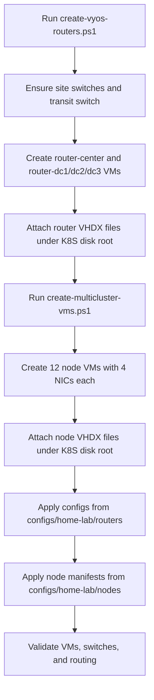
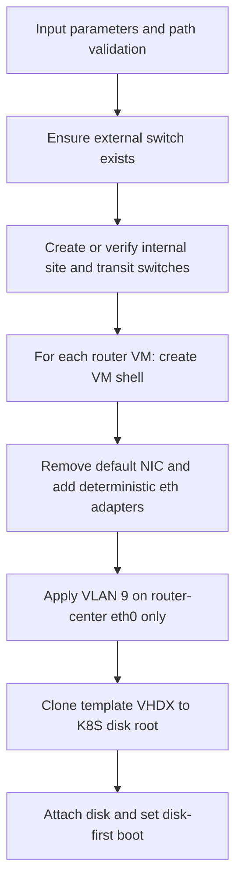

# System Design - VyOS Home-Lab Multicluster

## Purpose and scope

This document describes the full architecture, networking model, workload placement, and operating behavior of the Hyper-V-based multi-site home-lab in this repository.

It is intended to answer three questions:

1. What the system is.
2. What each subsystem does.
3. How all layers work together during normal operation and troubleshooting.

## System at a glance

The lab provisions and configures:

- 4 VyOS routers (1 central transit/egress + 3 site routers)
- 4 Kubernetes clusters across 3 sites
- 12 total nodes (3 nodes per cluster: `ctrl01`, `work01`, `work02`)
- Site-local segmented networking (`kubes`, `storage`, `domain`, `seg1`)
- Centralized Internet egress through `router-center` on VLAN 9
- Shared platform services (Istio mesh, observability, and storage)

## Diagram model

Use the diagrams in this order:

1. `diagrams/Architecture-Overview.mmd` (architecture overview)
2. `diagrams/Clusters-and-Workloads.mmd` (systems view)
3. `diagrams/Network-Topology.mmd` (detail view)

Companion view:

- `diagrams/System-Design.mmd` (cross-domain control and traffic summary)


## Diagram intent and audience

- `Architecture-Overview.mmd`
  - Purpose: Strategic topology of sites, central routing, service-mesh overlay, workloads, and shared services.
  - Audience: Architects and reviewers.
  - Density: Low-to-medium (component complete, no per-node NIC/IP breakout).
- `Clusters-and-Workloads.mmd`
  - Purpose: Engineering systems model with node hostnames, NIC/IP assignments, and workload relationships.
  - Audience: Platform and workload operators.
  - Density: High at the systems layer.
- `Network-Topology.mmd`
  - Purpose: Hyper-V wiring and routing behavior at switch/subnet/router level.
  - Audience: Infrastructure and troubleshooting.
  - Density: High with network implementation detail.

## Core architecture components

| Domain | Components | Primary responsibility |
| --- | --- | --- |
| Routing fabric | `router-center`, `router-dc1`, `router-dc2`, `router-dc3` | Site gateway routing, transit convergence, and Internet egress |
| Hyper-V network | `vSwitch-dc*-kubes/storage/domain/seg1`, `vSwitch-transit`, `cotpa-vlans_vsw` | Segment isolation, inter-site transit, and external uplink |
| Compute | `dc1manager`, `dc1domain`, `dc2domain`, `dc3domain` | Kubernetes control and workload execution |
| Service platform | Istio control plane/east-west gateways, observability stack, NetApp storage | Service-to-service networking, telemetry, and persistent data |
| Automation | `scripts/create-vyos-routers.ps1`, `scripts/create-multicluster-vms.ps1` | Repeatable provisioning and deterministic topology assembly |
| Configuration data | `configs/home-lab/routers/*.vyos`, `configs/home-lab/nodes/*.yaml` | Router policy and node interface/runtime definitions |

## Site and cluster model

| Site | Cluster(s) | Role |
| --- | --- | --- |
| dc1 | `dc1manager`, `dc1domain` | Management/control services plus app domain workloads |
| dc2 | `dc2domain` | Remote app domain site |
| dc3 | `dc3domain` | Remote app domain site |

Cluster naming convention:

- Management: `dc1manager-*`
- App domains: `dc1domain-*`, `dc2domain-*`, `dc3domain-*`
- Node roles: `ctrl01`, `work01`, `work02`

## Network segmentation and addressing model

Each site uses four primary segments:

- `eth0` -> `kubes`
- `eth1` -> `storage`
- `eth2` -> `domain`
- `eth3` -> `seg1`

### Site segment ranges

| Site | kubes | storage | domain | seg1 |
| --- | --- | --- | --- | --- |
| dc1 | `10.1.4.0/24` | `172.16.10.0/24` | `192.168.1.0/24` | `1.1.0.0/24` |
| dc2 | `10.2.4.0/24` | `172.16.20.0/24` | `192.168.2.0/24` | `1.2.0.0/24` |
| dc3 | `10.3.4.0/24` | `172.16.30.0/24` | `192.168.3.0/24` | `1.3.0.0/24` |

### Transit and egress

- Transit network: `10.254.0.0/24` on `vSwitch-transit`
- `router-center`: `10.254.0.1`
- Site transit peers:
  - `router-dc1`: `10.254.0.2`
  - `router-dc2`: `10.254.0.3`
  - `router-dc3`: `10.254.0.4`
- External egress: `router-center` `eth0` on VLAN 9 via `cotpa-vlans_vsw`

## Control plane, workload plane, and shared services

- Control/management behavior:
  - `dc1manager` hosts management functions and control integrations.
  - Istio control-plane behavior is anchored in management-domain services.
- Application behavior:
  - Domain clusters run app workloads (for example, Keycloak, PostgreSQL, Rocket.Chat, NATS, MongoDB based on systems diagram scope).
  - App workloads can communicate across sites using mesh-managed paths.
- Shared platform behavior:
  - Observability ingests metrics/logging from management and app domains.
  - NetApp-backed storage provides shared persistence surfaces.

## How the design works end-to-end

1. Node traffic enters the site gateway path through site-local segments.
2. Site routers (`router-dc1/2/3`) route local and remote traffic and advertise toward transit.
3. Inter-site traffic converges on `vSwitch-transit` and is forwarded by `router-center` when required.
4. Internet-bound flows are forced through `router-center` and exit on VLAN 9.
5. Service-to-service behavior is overlaid by Istio (east-west gateway pattern).
6. Telemetry and storage integrations run as shared cross-domain dependencies.

## Worked examples

### Example 1: Cross-site service call (dc2 app -> dc1 app)

1. A workload pod in `dc2domain` sends a request to a service hosted in `dc1domain`.
2. The request is handled by the local mesh sidecar and sent through the dc2 east-west gateway.
3. The packet traverses `router-dc2` -> `vSwitch-transit` -> `router-dc1`.
4. The dc1 gateway forwards traffic to the destination service in `dc1domain`.
5. Return traffic follows the reverse route, with mesh policy and mTLS preserved.

### Example 2: Internet egress from an application node

1. A pod on `dc3domain-work01` initiates an outbound HTTPS call.
2. Traffic exits the node via site-local routing to `router-dc3`.
3. `router-dc3` forwards to transit (`10.254.0.0/24`) and then to `router-center`.
4. `router-center` forwards out `eth0` over VLAN 9 to `cotpa-vlans_vsw` and Internet.

### Example 3: Storage path usage for an app component

1. A workload in `dc1domain` mounts storage traffic on `eth1` (`172.16.10.0/24`).
2. Storage flows are isolated from control-plane and app-frontdoor segments.
3. NetApp-backed services are consumed without sharing the kubes/data-plane subnet.

### Example 4: Observability troubleshooting path

1. A service degrades in `dc2domain`.
2. Operator opens `diagrams/Clusters-and-Workloads.mmd` to confirm expected node/service placement.
3. Operator uses `diagrams/Network-Topology.mmd` to verify site router and subnet path assumptions.
4. Metrics/logs from observability are correlated with routing and mesh behavior to isolate fault domain.

## Visual conventions

- Muted palette with class-based semantics:
  - Management/control plane
  - App clusters/workloads
  - Network infrastructure
  - Shared services
  - External dependencies
- Edge labels:
  - `transit` for site-to-center routing path
  - `VLAN 9 egress` for center-to-Internet path
  - Mesh labels for east-west and control relationships

## Provisioning flow



## Router script logic



## Operations examples

### Example: verify central VLAN 9 uplink

```powershell
Get-VMNetworkAdapterVlan -VMName router-center -VMNetworkAdapterName eth0
```

Expected: Access mode on VLAN 9.

### Example: verify all routers and core clusters are running

```powershell
Get-VM -Name router-center,router-dc1,router-dc2,router-dc3,dc1manager-ctrl01,dc1domain-ctrl01,dc2domain-ctrl01,dc3domain-ctrl01 | Select-Object Name,State
```

Expected: State `Running` for all targeted VMs.

### Example: verify node manifest interface uniqueness after edits

```powershell
Select-String -Path configs/home-lab/nodes/*.yaml -Pattern "172\.16\.10\.109|172\.16\.10\.111"
```

Expected: `172.16.10.109` on `dc1manager-work02` and `172.16.10.111` on `dc1domain-ctrl01`.

## Data integrity checks

Resolved in this implementation pass:

- Duplicate storage IP was removed by changing `dc1domain-ctrl01` eth1.
- Current addresses:
  - `configs/home-lab/nodes/dc1manager-work02.yaml` -> `172.16.10.109`
  - `configs/home-lab/nodes/dc1domain-ctrl01.yaml` -> `172.16.10.111`

## Key repository paths

- Architecture overview: `diagrams/Architecture-Overview.mmd`
- Systems detail: `diagrams/Clusters-and-Workloads.mmd`
- Network topology: `diagrams/Network-Topology.mmd`
- Cross-domain summary: `diagrams/System-Design.mmd`
- Router configs: `configs/home-lab/routers/`
- Node manifests: `configs/home-lab/nodes/`
- VM metadata/runtime paths: `configs/home-lab/vms/`
- Router provisioning: `scripts/create-vyos-routers.ps1`
- Node provisioning: `scripts/create-multicluster-vms.ps1`
- Operational guide: `docs/Runbook.md`

## Operational notes and assumptions

- All VM disks are expected under `D:\Production_Data\HyperV\Virtual Hard Disks\K8S`.
- Only `router-center` should carry external VLAN 9 uplink semantics.
- Site and transit switches are internal Hyper-V switches.
- The design assumes deterministic NIC ordering (`eth0..eth3`) is preserved.
