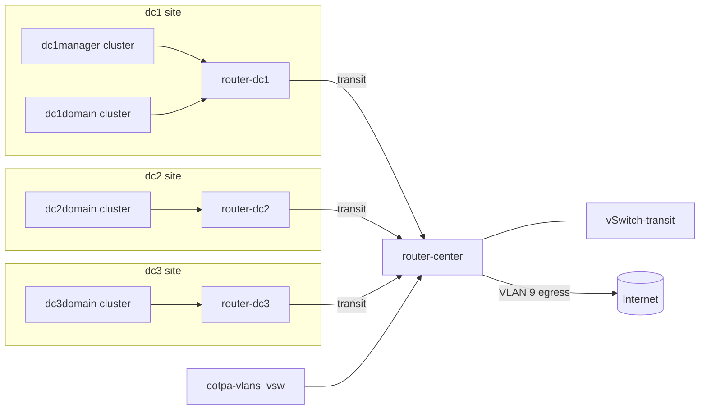
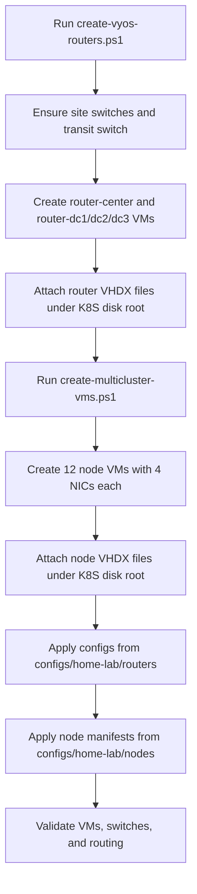
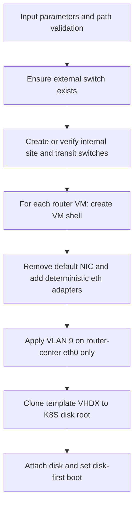

# System Design - VyOS Home-Lab Multicluster

## Overview

This repository defines and automates a Hyper-V based multi-site home-lab.

It provisions:

- 4 VyOS routing tiers (1 central, 3 site routers)
- 4 Kubernetes clusters across 3 sites
- Site-local network segmentation per cluster node
- A transit path from each site to a central egress router
- Internet egress through router-center on VLAN 9

## What This Repository Is

This is an infrastructure and operations repository for a reproducible lab topology.

It includes:

- Hyper-V provisioning scripts for routers and cluster VMs
- VyOS configuration fragments for site and central routing
- Node manifest files for each cluster node
- Diagrams and runbook documentation for deployment and validation

## What It Does

At a high level, the repository performs three things:

1. Builds network and VM primitives in Hyper-V.
2. Applies routing intent with VyOS config fragments.
3. Provides repeatable node definitions for the Kubernetes clusters.

## How It Works

### Logical Architecture

### Provisioning Sequence

### Router Script Logic

## Key Repository Paths

- Router configs: configs/home-lab/routers/
- Node manifests: configs/home-lab/nodes/
- VM metadata/runtime paths: configs/home-lab/vms/
- Router provisioning: scripts/create-vyos-routers.ps1
- Node provisioning: scripts/create-multicluster-vms.ps1
- Topology diagrams: diagrams/Network-Topology.mmd and diagrams/System-Design.mmd
- Operational guide: docs/Runbook.md

## Data and Traffic Intent

- Site routers are the default gateways for local node segments.
- router-center is the transit and egress convergence point.
- The external uplink path is cotpa-vlans_vsw to router-center.
- Internet egress is represented as VLAN 9 egress on the router-center to Internet edge.

## Operational Notes

- All VM disks are expected under D:\Production_Data\HyperV\Virtual Hard Disks\K8S.
- Only router-center should carry the external VLAN 9 access uplink.
- Site and transit switches are internal-only Hyper-V switches.
